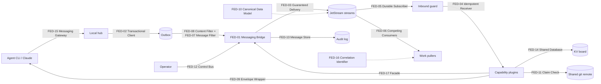
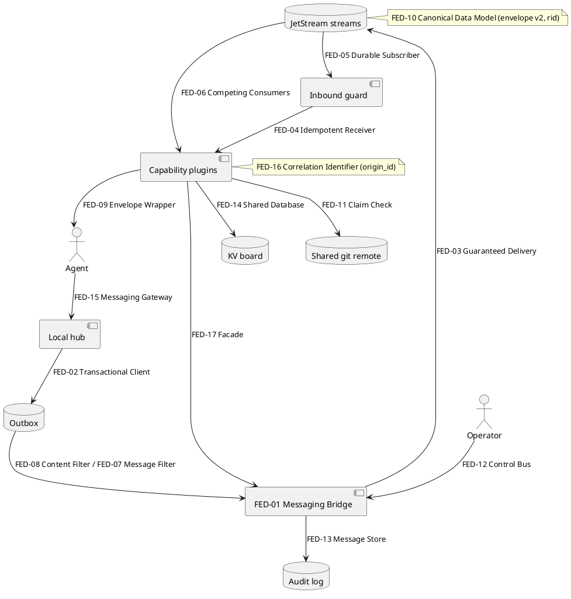
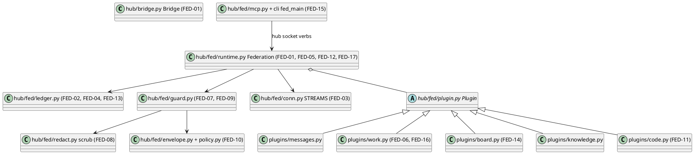

# Design pattern diagrams

Generated from `.context/design-patterns.md` and verified repository evidence. User notes may be added outside the generated sections.

## Abstract pattern architecture

## Concrete implementation architecture

## Traceability

| Registry ID | Pattern | Role | Repository location | Evidence |
| --- | --- | --- | --- | --- |
| FED-01 | Messaging Bridge | hub messaging <-> NATS | `hub/bridge.py` Bridge, `hub/fed/runtime.py` Federation | `hub/tests/test_fed_live.py`, `hub/tests/test_nats_federation.py` |
| FED-02 | Transactional Client | outbox in the state change's transaction | `hub/fed/runtime.py` Federation.stage, `hub/fed/ledger.py` outbox_add, `hub/store.py` Store._outbox | `hub/tests/test_fed_live.py` |
| FED-03 | Guaranteed Delivery | JetStream file streams, R3 | `hub/fed/conn.py` STREAMS, `hub/fed/admin.py` provision | `hub/tests/test_fed_live.py` |
| FED-04 | Idempotent Receiver | fed_seen + Nats-Msg-Id | `hub/fed/runtime.py` Federation.receive, `hub/fed/ledger.py` seen | `hub/tests/test_fed_live.py` |
| FED-05 | Durable Subscriber | per-node durable pull consumers | `hub/fed/runtime.py` Federation._bind_core | `hub/tests/test_fed_live.py` |
| FED-06 | Competing Consumers | per-publisher work-queue consumers | `hub/fed/plugins/work.py` Work.on_tick | `hub/tests/test_fed_live.py` |
| FED-07 | Message Filter | trust, scope, spoof, privilege | `hub/fed/guard.py` inbound/outbound | `hub/tests/test_fed_unit.py`, `hub/tests/test_fed_live.py` |
| FED-08 | Content Filter | secret redaction/blocking | `hub/fed/redact.py` scrub | `hub/tests/test_fed_unit.py`, `hub/tests/test_fed_live.py` |
| FED-09 | Envelope Wrapper | remote text framed as data | `hub/fed/guard.py` wrap, `hub/fed/plugins/messages.py` | `hub/tests/test_fed_unit.py`, `hub/tests/test_fed_live.py` |
| FED-10 | Canonical Data Model | envelope v2, rid | `hub/fed/envelope.py` make, `hub/fed/policy.py` rid_for_remote | `hub/tests/test_fed_unit.py`, `hub/tests/test_fed_live.py` |
| FED-11 | Claim Check | git refs + pointer | `hub/fed/plugins/code.py` Code.v_share/v_fetch | `hub/tests/test_fed_live.py` |
| FED-12 | Control Bus | kill switch, revoke notice | `hub/fed/runtime.py` _v_kill, Federation._on_ctl | `hub/tests/test_fed_live.py` |
| FED-13 | Message Store | audit log | `hub/fed/ledger.py` audit | `hub/tests/test_fed_live.py` |
| FED-14 | Shared Database | KV board with CAS | `hub/fed/plugins/board.py` Board._write | `hub/tests/test_fed_live.py` |
| FED-15 | Messaging Gateway | CLI + MCP over the hub socket | `hub/fed/mcp.py` handle, `hub/cli.py` fed_main | `hub/tests/test_fed_unit.py` |
| FED-16 | Correlation Identifier | result -> origin item | `hub/fed/plugins/work.py` Work._on_result | `hub/tests/test_fed_live.py` |
| FED-17 | Facade | runtime as plugin ctx | `hub/fed/runtime.py` Federation, `hub/fed/plugin.py` Plugin | `hub/tests/test_fed_live.py` |
