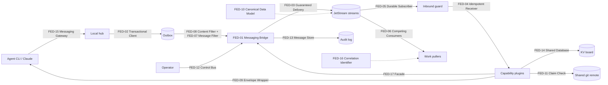
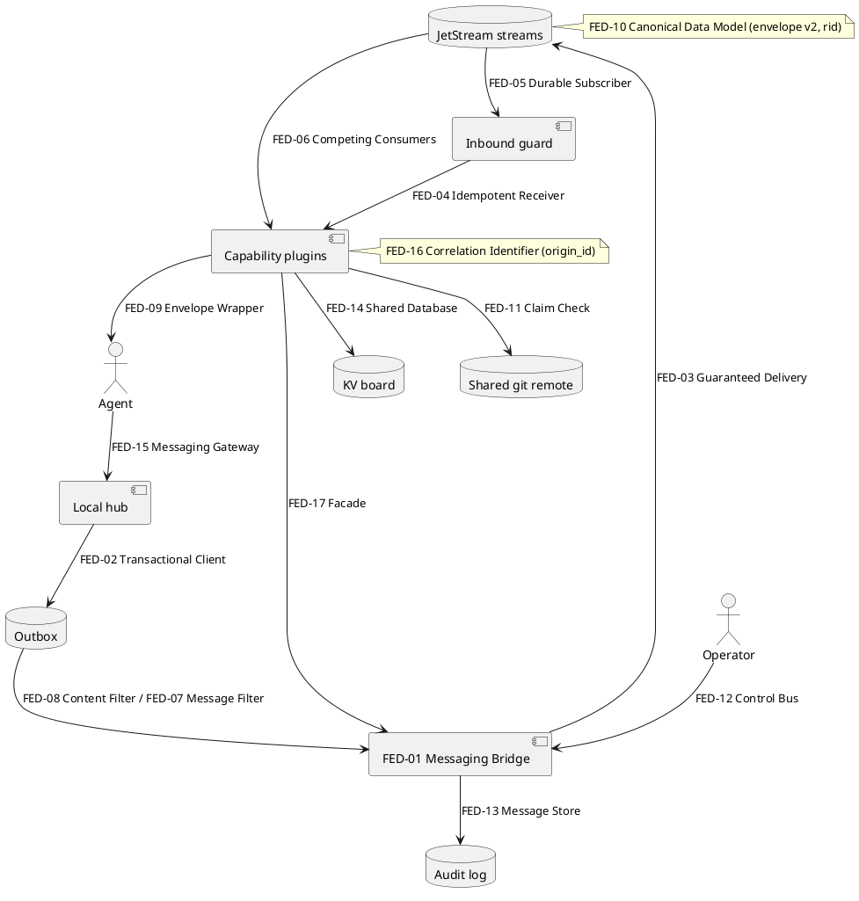
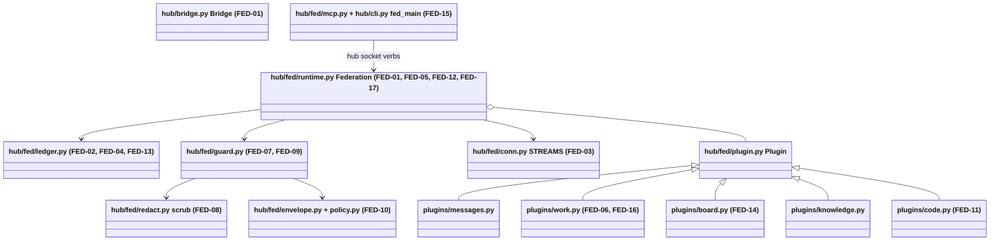
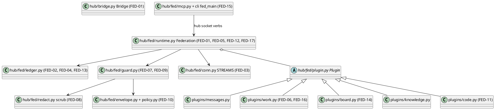
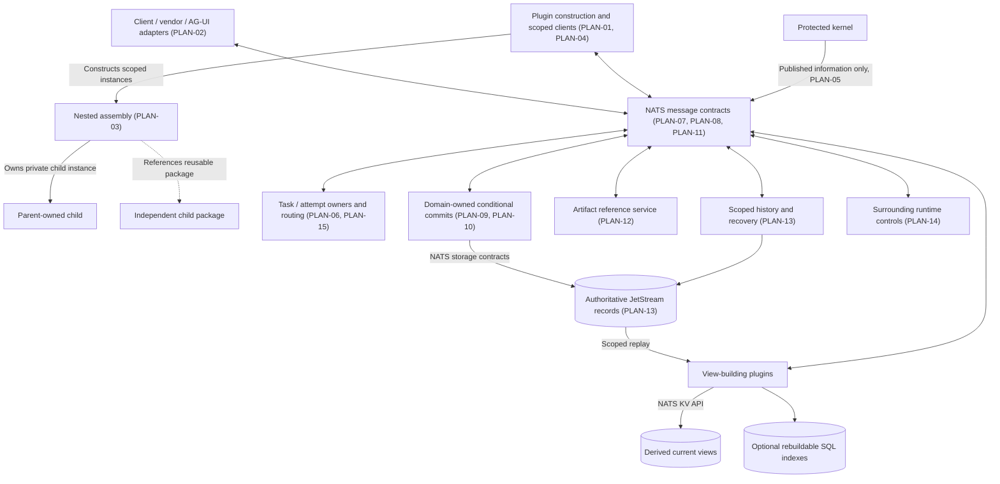
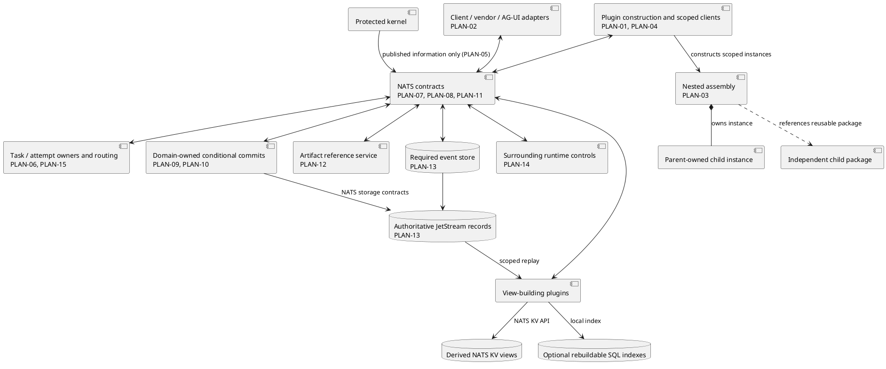
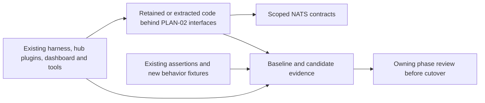
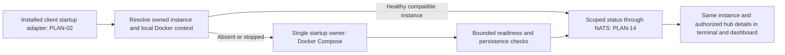
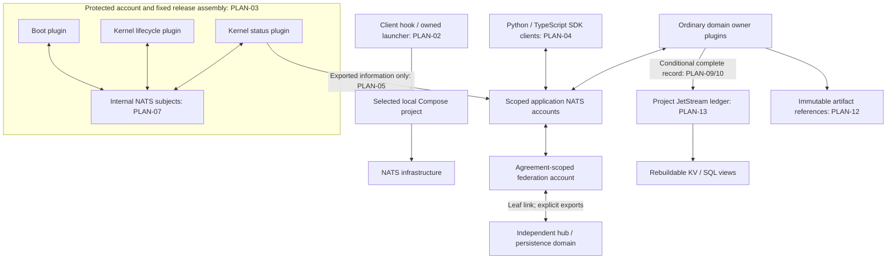

# Design pattern diagrams

Generated from `.context/design-patterns.md` and verified repository evidence. User notes may be added outside the generated sections.

## Abstract pattern architecture





## Concrete implementation architecture





## Traceability

| Registry ID | Pattern | Role | Repository location | Evidence |
| --- | --- | --- | --- | --- |
| FED-01 | Messaging Bridge | hub messaging <-> NATS | `hub/bridge.py` Bridge, `hub/fed/runtime.py` Federation | `hub/tests/test_fed_live.py`, `hub/tests/test_nats_federation.py` |
| FED-02 | Transactional Client | outbox in the state change's transaction | `hub/fed/runtime.py` Federation.stage, `hub/fed/ledger.py` outbox_add, `hub/store.py` Store._outbox | `hub/tests/test_fed_live.py` |
| FED-03 | Guaranteed Delivery | JetStream file streams, R3 | `hub/fed/conn.py` STREAMS, `hub/fed/admin.py` provision | `hub/tests/test_fed_live.py` |
| FED-04 | Idempotent Receiver | fed_seen + Nats-Msg-Id | `hub/fed/runtime.py` Federation.receive, `hub/fed/ledger.py` seen | `hub/tests/test_fed_live.py` |
| FED-05 | Durable Subscriber | per-node durable pull consumers | `hub/fed/runtime.py` Federation._bind_core | `hub/tests/test_fed_live.py` |
| FED-06 | Competing Consumers | per-publisher work-queue consumers | `hub/fed/plugins/work.py` Work.on_tick | `hub/tests/test_fed_live.py` |
| FED-07 | Message Filter | trust, scope, spoof, privilege | `hub/fed/guard.py` inbound/outbound | `hub/tests/test_fed_unit.py`, `hub/tests/test_fed_live.py` |
| FED-08 | Content Filter | secret redaction/blocking | `hub/fed/redact.py` scrub | `hub/tests/test_fed_unit.py`, `hub/tests/test_fed_live.py` |
| FED-09 | Envelope Wrapper | remote text framed as data | `hub/fed/guard.py` wrap, `hub/fed/plugins/messages.py` | `hub/tests/test_fed_unit.py`, `hub/tests/test_fed_live.py` |
| FED-10 | Canonical Data Model | envelope v2, rid | `hub/fed/envelope.py` make, `hub/fed/policy.py` rid_for_remote | `hub/tests/test_fed_unit.py`, `hub/tests/test_fed_live.py` |
| FED-11 | Claim Check | git refs + pointer | `hub/fed/plugins/code.py` Code.v_share/v_fetch | `hub/tests/test_fed_live.py` |
| FED-12 | Control Bus | kill switch, revoke notice | `hub/fed/runtime.py` _v_kill, Federation._on_ctl | `hub/tests/test_fed_live.py` |
| FED-13 | Message Store | audit log | `hub/fed/ledger.py` audit | `hub/tests/test_fed_live.py` |
| FED-14 | Shared Database | KV board with CAS | `hub/fed/plugins/board.py` Board._write | `hub/tests/test_fed_live.py` |
| FED-15 | Messaging Gateway | CLI + MCP over the hub socket | `hub/fed/mcp.py` handle, `hub/cli.py` fed_main | `hub/tests/test_fed_unit.py` |
| FED-16 | Correlation Identifier | result -> origin item | `hub/fed/plugins/work.py` Work._on_result | `hub/tests/test_fed_live.py` |
| FED-17 | Facade | runtime as plugin ctx | `hub/fed/runtime.py` Federation, `hub/fed/plugin.py` Plugin | `hub/tests/test_fed_live.py` |

## Planned platform rearchitecture (proposal, October 9, 2026)

This section records the proposed destination for review. Existing FED diagrams above describe the current implementation and remain unchanged. PLAN entries have status `planned` and do not claim implemented or approved behavior.





### Proposed contract ownership

| Proposed contract / component | Owning phases | Recorded patterns |
| --- | --- | --- |
| Plugin construction, nested lifecycle, scoped context | P02–P04 | PLAN-01, PLAN-03, PLAN-04, PLAN-05 |
| Client, worker, vendor and UI interfaces | P06, P07, P11 | PLAN-02 |
| Provider and eligible-work policy selection | P05, P08, P10 | PLAN-06, PLAN-15 |
| Shared envelopes and NATS communication | P01–P12 | PLAN-07, PLAN-08, PLAN-11 |
| NATS-owned records, durable intent and duplicate handling | P01, P04, P05, P10 | PLAN-09, PLAN-10, PLAN-13 |
| Scoped replay, derived KV and optional SQL indexes | P04, P07, P12 | PLAN-04, PLAN-13 |
| Artifact exchange, event history, authorized controls | P04, P07, P10, P12 | PLAN-12, PLAN-13, PLAN-14 |

Implementation symbols and files will be registered in the owning phases. The proposal is [docs/planning/2026-10-09/implementation-plan.md](../docs/planning/2026-10-09/implementation-plan.md).

STATE-01 updates only the planned destination. Configuration/registry KV records have their own owner; task-summary KV and SQL views are derived. Same-stream atomic persistence does not make cross-stream transfers, projection updates or tool actions atomic. Separate hubs preserve origin-task and receiver-execution authority. Historical FED diagrams above remain unchanged.


### ADD-01: Existing implementations through reviewed boundaries

This proposal refines PLAN-02. Historical FED diagrams above remain unchanged. Existing behavior stays available until its owning phase proves compatibility and migration. Replacing implementation does not authorize removing capability.



See [component preservation](../docs/planning/2026-10-09/component-preservation.md) for concrete source ownership, tests, gains and migration requirements. This is a verification and migration view; it introduces no new pattern catalog entry.

### LOCAL-01: Planned automatic startup and status

This refines planned PLAN-02 client interfaces and PLAN-14 status/control boundaries. Existing implementation diagrams remain historical. Bootstrap coordination runs before NATS is available and grants no general kernel write access.



P02 verifies bootstrap with explicit later-service fixtures; P06 verifies actual client launch; P07 verifies dashboard consistency; P10 verifies real hub visibility; P12 repeats the packaged workflow. The current plan defines conflict, timeout and recovery handling. No new pattern catalog entry or implemented relationship is claimed.

## October 9 baseline repairs: current work reservation boundary

The diagrams above are preserved as design history. This current detail revises FED-02, FED-04, FED-06, FED-07, FED-10 and FED-16; it does not mark the planned platform phases implemented.

```mermaid
sequenceDiagram
  participant O as Origin work plugin
  participant N as NATS / JetStream
  participant R as Receiving work plugin
  participant W as Local worker
  O->>O: Commit pending task and v3 offer outbox together
  O->>N: Publish versioned offer
  N->>R: Deliver or redeliver
  R->>R: Commit attributed blocked task and claim outbox together
  R->>N: Claim with offer digest and execution identity
  N->>O: Deliver claim
  O->>O: Commit one selected executor and grant outbox together
  O->>N: Publish grant
  N->>R: Deliver matching grant
  R->>R: Validate origin/offer/execution; become ready
  R->>W: Local claim and execution
  W->>R: Done or failed
  R->>R: Terminal state and durable return intent commit together
  R->>N: Retry stable result from outbox after any restart
  N->>O: Deliver result
  O->>O: Validate selected executor, grant, task/repository and content digest
```

An origin or receiver outage delays the exchange without selecting another executor. V2 work consumers use a different exact subject and cannot consume v3 offers. Same-peer nodes are distinct execution identities; the peer credential remains the authenticated principal. Schema migration 5 and snapshot publication are detailed in `docs/planning/2026-10-09/governance-repairs.md`.

## P00 runtime and account refinement — proposed

This detail supports PLAN-02/03/04/05/07/08/09/10/12/13/14. It remains a proposal in `docs/planning/2026-10-09/delivery/decisions/`; the bounded runtime spike proves only client wire interoperability. Existing implementation and historical diagrams above remain unchanged.



No application arrow enters the protected account. The broker is shared infrastructure, while account permissions and domain-owner validation enforce distinct boundaries. A leaf link does not merge persistence or ownership. Proposed separate protected processes add lifecycle overhead; P02 must measure it. No Go implementation replaces current Python business logic through this diagram.
