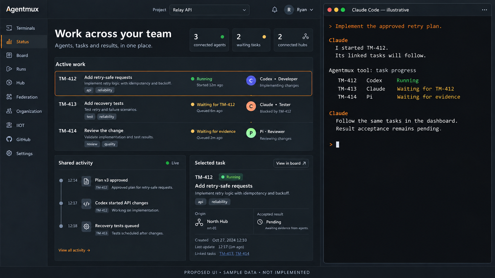
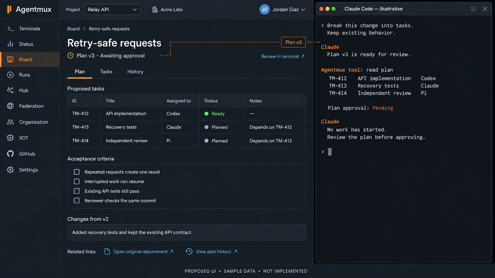
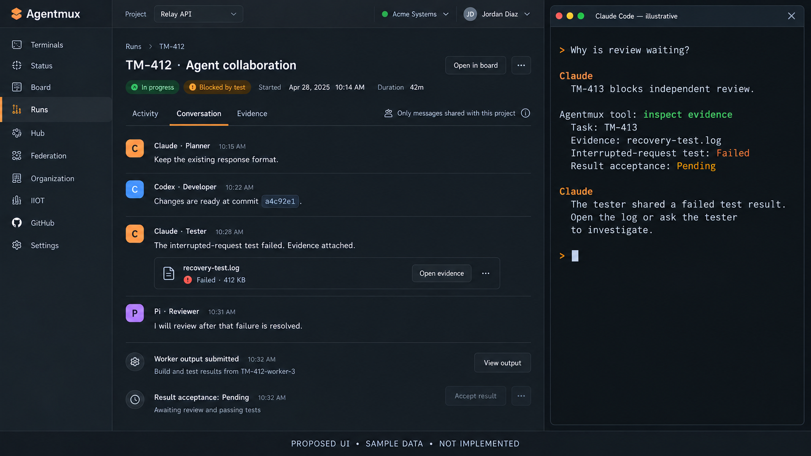
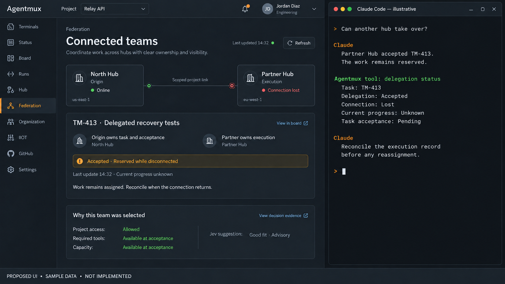
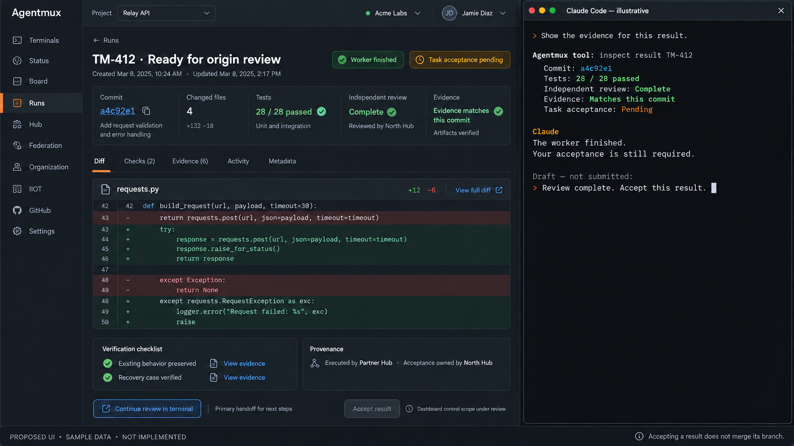
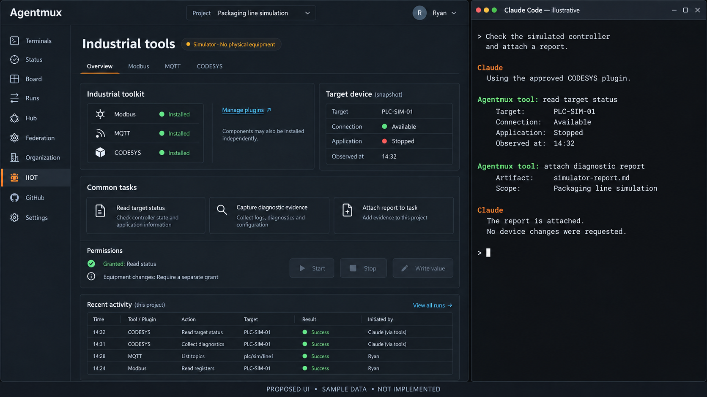

# Agentmux dashboard and terminal concepts

Six visual concepts based on the [implementation plan](../implementation-plan.md), prepared October 9, 2026. Each pairs an enhanced Agentmux dashboard with an illustrative Claude Code terminal. Open any image for the full-size PNG.

For a portable copy with all images embedded, use the [single-file HTML visual review](../agentmux-visual-review.html). It includes image zoom, review notes and the source plan. See the [sharing instructions](../review-site/README.md).

**These are proposed interfaces with fictional sample data. They are not screenshots of implemented or tested features.** Names, dates, counts, code and commit IDs are placeholders. The scenes show separate possible workflow states, not a continuous execution record.

The current dashboard remains the starting point. Its ten views—Terminals, Status, Board, Runs, Hub, Federation, Organization, IIOT, GitHub and Settings—remain visible. These concepts retain its dark slate and orange styling. The [component preservation review](../component-preservation.md) defines the wider obligation to preserve functionality; these six scenes do not replace that inventory.

## How the terminal and dashboard work together

1. A developer requests work or reviews a result in a supported AI client, such as Claude Code, Codex or Pi.
2. The client integration calls Agentmux services. Services check access, own the work records and exchange commands and events through NATS. The planned shared persistence uses NATS JetStream behind those services.
3. Authorized activity reaches the dashboard through the planned AG-UI integration and CopilotKit components. The dashboard displays the same task IDs, plan versions, evidence and acceptance state as the client.
4. Review decisions return through an authorized service operation. Plan approval, task acceptance and repository merge remain separate decisions.

The right-hand panels illustrate this interaction. They are not exact screenshots of a particular client or executable command documentation. Available hooks, controls and conversation visibility depend on each host's supported integration. The component design and event flow remain subject to the phase gates in the plan.

## 1. Workspace and AI terminal

**Preserves:** terminal observation, status feeds and work visibility.

**Extends:** existing roles and task dependencies into a shared view across client and dashboard, with visible origin ownership. The developer starts TM-412 in the terminal and follows its progress in Status. Tests and review wait for their prerequisites. Worker activity does not imply result acceptance.

**Plan:** P05–P07.

## 2. Planning and the task board

**Preserves:** the existing board and work controls.

**Extends:** existing tasks and history with a unified view of plan versions, linked evidence and explicit approval state. The terminal proposes a plan; the dashboard makes it easy to inspect before approval. All criteria remain unchecked. A task marked Ready still requires the plan's approval before execution.

**Plan:** P05–P07. Dashboard approval controls remain subject to review.

## 3. Agent collaboration and evidence

**Preserves:** run inspection and message feeds.

**Extends:** existing messages and evidence with shared task identities, scoped visibility and clear reasons for blocked work. The terminal explains why review is waiting, while Runs exposes the failed log. These are messages shared with the project, not model-internal reasoning or unrestricted access to private conversations.

**Plan:** P05–P07. Failed evidence remains visible and acceptance stays pending.

## 4. Connected teams and routing decisions

**Preserves:** federation visibility and existing cross-hub work capabilities.

**Adds:** independent hub authority, scoped cross-organization delegation and an explanation of why a team was selected. North Hub owns TM-413 and accepts its result; Partner Hub executes it. After disconnection, the accepted work stays reserved and current progress is unknown. A connection loss does not authorize duplicate execution elsewhere.

**Plan:** P08 and P10. Jev provides optional advice after eligibility checks; it cannot grant access, release a reservation or authorize reassignment. No measured token savings or decision accuracy is claimed.

## 5. Result review and acceptance

**Preserves:** run and review information.

**Extends:** existing review evidence with consistent commit binding and explicit origin-owned acceptance across clients and hubs. The terminal's acceptance request is a draft that has not been submitted. The disabled dashboard button illustrates the open decision about dashboard controls, not a permanent restriction. Accepting a result does not merge its branch.

**Plan:** P05–P07 and P10. Test counts and the code preview are fictional design content, not repository verification evidence.

## 6. Plugin tools and industrial operations

**Preserves:** the IIOT views and existing protocol capabilities.

**Adds:** declared nested plugin packages, permission-aware tools and domain-specific dashboard content. This example package declares that its components can also be installed independently; other packages may declare different rules. The terminal uses an approved tool to inspect a simulated controller and attach a report. Start, Stop and Write value remain disabled without a separate grant.

**Plan:** P03, P06–P07 and P11. Trusted plugins come first; containment of untrusted plugins is a later phase. The target and results are simulated. Vendor, platform and hardware support require separate qualification.

## Asset record

All six PNGs were produced with built-in image generation, then edited with the same tool to refine the terminal panels and workflow states. Originals remain in the generation output directory. The [prompt manifest](prompts.json) records the exact generation and edit prompts, source references, phase mappings, file dimensions and SHA-256 hashes.

This asset pack introduces no runtime implementation. Implementation remains paused until the required plan review. Merging still requires Ryan's review with Nick and Ryan's explicit authorization.
