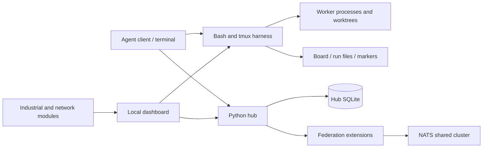
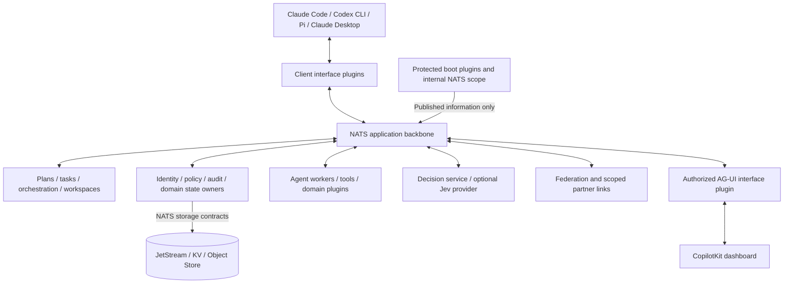
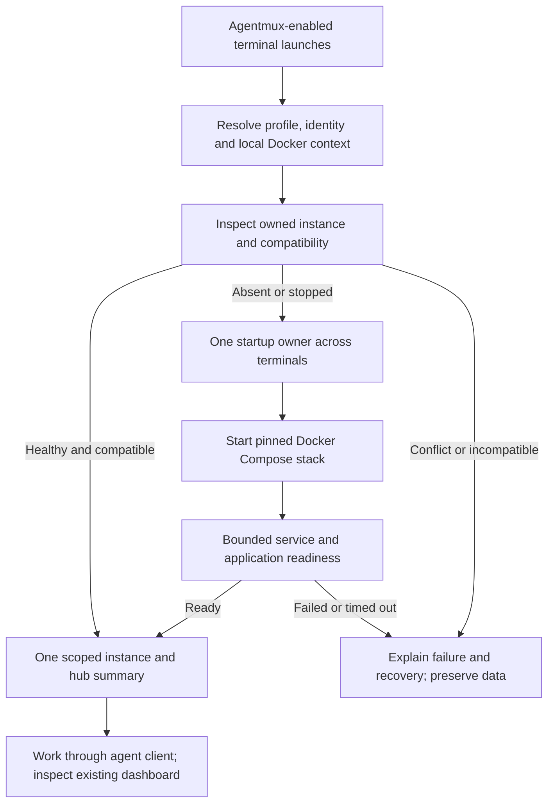
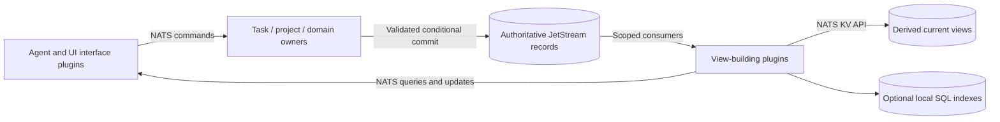
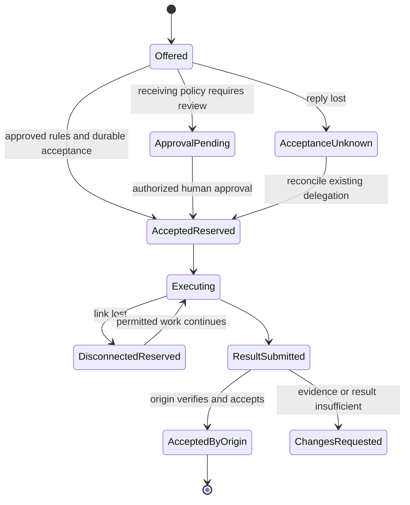

# Agentmux phased implementation plan

**Status: planning baseline for gated implementation. Ryan requested committing and pushing this package before phased work begins. P00 and later gates are not yet passed; no Nick review or merge approval is recorded.**
Prepared October 9, 2026. Branch: `feat/agentmux-platform-rearchitecture`. Baseline: `df46e94570fadf78ef67a75a692dd48b968a10f7`, Agentmux 0.32.0.

This plan combines the original architecture review, repository analysis, accepted interview decisions, NATS and UI architecture brief, both Jev research rounds, the video supplement, and the proposed skill suite. It defines a complete delivery sequence and the evidence needed to advance. The accompanying presentation explains the before/after experience and each phase. The structured [phase definitions](phases.json) and [coverage appendix](coverage.md) retain individual acceptance and opportunity identifiers.

**Storage revision, October 9:** Ryan approved the NATS-backed shared-persistence direction described in STATE-01 below. This approval updates the design; implementation and merge still require their existing review gates.

## 1. Delivery recommendation

Build the reusable plugin foundation before expanding domain behavior. Prove one local workflow, then its multi-user, client, dashboard, semantic-decision, and federated forms. Reach the first sellable release only after cross-organization federation and operational recovery pass. Add the remaining experimental Jev functions through measured batches. Add hostile-code containment in a later, explicitly qualified phase.

P00–P12 form the proposed first-release sequence. P13 retains all remaining Jev and skill proposals. P14 delivers the accepted later sandboxing direction. This release split is a recommendation for review, not a previously approved scope reduction. No catalog item disappears because it is not enabled in the first release. Each proposal receives an implementation/evaluation disposition and an owning phase.

The release story is: a developer starts work in a supported agent client, Agentmux produces and tracks a plan, scoped plugins coordinate workers, authorized hubs can execute delegated work, the origin reviews evidence and accepts results, and the dashboard shows the same durable history. A third-party author can add capabilities through documented contracts without changing the protected boot assembly.

## 2. Confirmed decisions and unresolved choices

Confirmed: minimal protected kernel plugins; no kernel replacement; surrounding subscribers may observe exported kernel status but have no general kernel write path; NATS for every internal component interaction and preferred shared persistence; optional rebuildable SQL views; language-neutral plugin contracts; explicit independent/private nesting; automatically provided scoped context; trusted code first; native macOS/Linux and WSL initially; local and self-hosted teams; same- and cross-organization federation in the first release; origin-owned task acceptance; accepted disconnected work remains reserved; automatic receiving-hub acceptance only within approved rules; agent-client-led interaction; AG-UI/CopilotKit dashboard using Atomic Design; industrial engineering as optional domain packages; phased verification and no merge before Ryan/Nick review.

The following decisions must be made explicitly. Recommendations below allow review of a concrete plan without pretending they have been accepted.

| Decision | Proposed starting point | Must be resolved before |
| --- | --- | --- |
| Primary launch audience and proof workflow | General developer teams with excellent solo use. Prove a software change and a scoped industrial reference workflow. Market emphasis remains open. | P00 exit |
| Dashboard command scope | Activity plus approvals and supported run controls. Work creation remains in agent clients initially. | P00 exit / P07 design |
| Runtime language and SDKs | Run a bounded engineering comparison in P00. Prefer a small typed runtime and at least two interoperable SDK implementations. No language is silently selected here. | P01 implementation |
| Storage qualification | STATE-01 establishes NATS as the preferred shared authority. Pin stream/record boundaries, versions, access, retention and recovery. SQL serves optional rebuildable views; an authoritative SQL exception needs an evidenced unmet requirement and explicit review. | P01/P04 |
| NATS account and JetStream domain layout | Separate kernel scope, scoped application identities, and explicit independent-hub boundaries. Project segregation must be broker- and service-enforced where confidentiality requires it. | P02/P04 |
| Identity provider and administration | Simple local identity plus standards-based self-hosted enrollment/SSO, with per-device service credentials and revocation. Select actual protocols/providers. | P04 |
| Execution trust and host isolation | Trusted installed plugins do not imply mutually trusted users or task code. Select OS/container/dedicated-host execution profiles that isolate project files and credentials before team use. Worktrees alone do not provide containment. | P00 decision, P04 proof |
| Offline actions and reassignment | Define grant expiry, revocation, new offline assignments, historical result receipt, and the handling of an unreachable old executor. Already accepted work stays reserved. | P00 invariants, P10 design |
| Supported host/tool versions | Pin OS/architecture/client/provider/tool versions based on actual-host tests, including WSL placement and Desktop connectivity. | P02/P06 |
| Capacity and recovery promises | Adopt proposed profiles in section 8 or replace them before load tests. | P00/P12 |
| Jev data, billing, and offline policy | Customer-owned secret reference, explicit data destinations, capped usage, no-Jev fallback. A token is not needed for planning. | P08 live evaluation |
| Industrial launch matrix | Preserve current capabilities through migration; explicitly select the first CODESYS/Siemens/Rockwell workflow and qualified tool versions. | P00/P11 |
| Build team, budget, and dates | Estimate after work-package sizing and proof spikes. Publish ranges tied to actual staffing. | Delivery commitment |
| Commercial packaging | Self-hosted distribution/support first. Verify dependency and model-provider terms and choose licensing. | P12 release |

Dashboard scope and workflow priorities were asked during preparation. Unanswered questions remain decision gates. They do not block producing this proposal.

## 3. Before and after

### Existing system

The repository is a useful operational harness with Bash/tmux process control, several agent launch paths, a local dashboard, boards/runs/approval markers, a single-writer Python hub and SQLite, and NATS federation extensions. It already includes messaging, handoffs, work sharing, board/knowledge/code sharing, and industrial/network tools. The new design preserves these capabilities, reuses their implementations where suitable, and replaces implicit coupling with contracts. ADD-01 requires a reviewed reason and compatibility evidence for each replacement.

Today several stores and completion signals coexist. A terminal, run ledger, board, hub row, and remote event do not form one transaction. Current federation connects clients to a shared NATS account/cluster and has a broad in-process plugin context. Shared board cards already use NATS KV with a local SQLite mirror; other hub tables remain authoritative SQLite records. The dashboard uses a local HTTP server and view scripts. It is not yet the proposed multi-user product or protected-kernel architecture.

The downloaded October 8 review reports its then-current uncommitted state and test outcomes. The later repository analysis is the baseline for this plan. Its reproduced subject/envelope dispatch mismatch, split work/provenance ingestion, result-staging crash window, and same-peer multi-node concern must become regression scenarios. Historical claims such as “exactly-once in effect” are not inherited as guarantees. The current branch supersedes the downloaded report's old uncommitted-main status. The governance check had passed before this planning review, but reconciliation of known baseline findings now leaves it blocked as described in section 13.

Sources: [federation design](../../FEDERATION.md), [hub contracts](../../PROTOCOL.md), [harness guide](../../USING_THE_HARNESS.md), and the source register below.

### Proposed product

Every ordinary product capability is a plugin, including storage, identity/policy/audit, orchestration, clients, UI interfaces, decisions, and domain tooling. Packaging, runtime placement, and permission scope are separate declarations. The operating system and broker are bootstrap infrastructure; representing product capabilities as plugins does not mean a plugin can create the substrate it already needs for communication.

A minimal launcher starts or reaches the configured broker and loads the protected boot assembly. Local boot-failure diagnostics are the bounded bootstrap exception. Protected plugins communicate on internal NATS contracts and publish permitted status. The surrounding plugin supervisor owns ordinary plugin lifecycle and health. Hosted inference, authentication-provider availability, and domain code cannot be prerequisites for deterministic boot.

Every double arrow above describes a contract exchange through NATS on the Agentmux side. Vendor APIs, local process I/O, provider HTTPS, and browser AG-UI transport terminate at their owning integration plugin. They do not form an alternate internal service channel.

### Changes the developer will notice

| Experience | Before | After |
| --- | --- | --- |
| Setup | Machine-specific harness/tool configuration | Tested local/team installer, enrollment, plugin selection, and diagnostics |
| Agent interaction | CLI/harness and terminal conventions | Supported client tooling with declared observability and control capabilities |
| Work tracking | Multiple local stores and completion markers | Explicit task/delegation/attempt/evidence/acceptance contracts |
| Shared persistence | Authoritative hub SQLite plus some NATS-backed shared features | Validated shared records in NATS, scoped access, and optional rebuildable query indexes |
| Team work | Shared conventions and broad local trust | User, node, project, service, and action scopes with audited ownership |
| Extension | Imports, scripts, broad context, view-specific code | Manifest, compatible SDK, scoped context, lifecycle, contributions, conformance |
| Remote execution | Existing shared-cluster federation | Independently administered hubs, scoped links, leaf topology, tested offline reservations |
| Dashboard | Local operator console and terminal views | Authorized project/hub views with replay, known/unknown state, and domain slots |
| Decisions and context | Repeated large-model attention and ad hoc rules | Exact checks first, bounded Jev advice where evaluated, reusable evidence and explicit fallback |
| Industrial work | Operational modules with mixed integration depth | Optional packages with declared vendor/tool/host capabilities and controlled actions |
| Product operation | Developer-managed environment | Documented upgrades, recovery, retention, support, qualification, and release evidence |

## 4. Component contracts and state ownership

**PluginContext** carries immutable instance/package identity, parent relationship, scoped logger, config view, lifecycle, clock, tracing/metrics, and approved NATS client handles. **OperationContext** carries validated caller/delegation identity, organization/project/workspace, task/run/attempt/operation IDs, deadline, cancellation, and approval references. Shared plugins never store a mutable global “current user.”

Children inherit allowed defaults and compatible service interfaces, not their parent's entire authority or secret-filled environment. Independent package installation is different from ownership of one runtime instance. Removing a parent cannot uninstall an independent child another parent uses. Stopping a child cannot dispose shared infrastructure it only borrowed.

Each business record has an authoritative owner. Task ownership and final acceptance belong to the origin hub. The receiver owns delegated execution attempts. A result submission references the authorized receiver, delegation, task version, repository/artifact digest, and validation evidence. Transport acknowledgment, worker completion, and accepted result remain different facts.

Storage is pluggable only within declared capabilities. A provider must prove the durability, concurrency and recovery semantics its consumers require. Ordinary domain plugins outside the protected kernel own validated state changes. NATS is the preferred shared persistence provider. No plugin reaches into another plugin's database, and no general consumer receives unrestricted raw write authority. Injected storage handles expose approved domain operations and permitted read scopes without unrestricted JetStream management, KV administration or another project's data. SQLite or another SQL engine may supply an optional query index/cache. Any exception that makes SQL authoritative must identify an unmet requirement, alternatives, migration costs and explicit review approval.

### LOCAL-01. Automatic local startup and instance status

**Accepted direction, October 9:** When a terminal or CLI with the installed, configured Agentmux plugin launches, its startup integration must ensure the local environment is running through Docker Compose. If a compatible authorized instance is already healthy, reuse it and show its details. Otherwise start the selected stack, wait for readiness and show the same details. This requirement is planned; this commit does not start or implement the stack.

The default is one local stack per enrolled user/profile and selected local Docker context, shared across that user's terminals and projects. Record a stable instance ID and explicit Compose project name so changing working directories does not create accidental stacks. Multiple instances require explicit profile selection. An intentional remote-hub profile connects to its selected hub; it must not create an unrelated local stack or enroll new hub trust. Resolve the selected context before any Docker action and refuse an unapproved remote Docker daemon or another user's instance.

1. **Inspect:** Resolve the installed release/configuration, profile and credentials. Check Docker/Compose prerequisites, ownership and compatibility. Discover the selected instance by authenticated identity and owned Compose resources, not an open port alone.
2. **Reuse or start:** Reuse a healthy compatible instance unchanged. If absent or explicitly stopped, one startup owner starts the pinned Compose services with persistent NATS volumes. Concurrent launches wait on the same result. Recover stale startup ownership after a crash without relying on a PID alone. Keep startup coordination outside the broker because NATS may not be available yet.
3. **Establish readiness:** Use service health checks and bounded application readiness probes for the protected boot assembly, NATS persistence and required runtime services. Starting containers is not sufficient. A partial stack, permission error, occupied port, image pull failure or incompatible running version produces a specific diagnostic and recovery action. Never silently reset volumes, migrate data, upgrade a live stack, create a second stack around a conflict or report success after a timeout. Set concrete deadlines in P00/P02 and publish them.
4. **Show the same summary:** Report whether the instance was started or reused; instance name/ID and version; local/remote profile and Compose project; selected Docker context; endpoint and dashboard link; readiness and NATS persistence health; active project/work summary where permitted; and authorized connected hubs. Include the source revision and observation time. Before a feature exists or when status cannot be read, show unavailable or unknown explicitly.
5. **Keep status honest:** For each visible hub, show its organization/scope, configured connection, federation state and observation age, plus known delegated/reserved work when permitted. Distinguish none configured, disconnected, stale, unknown and connected. NATS link reachability does not prove partner authorization, application readiness or spare capacity. Offline accepted work remains reserved. Launch never expands trust or discovers private hubs outside the caller's grant.
6. **Keep the session usable:** Display one concise interactive summary and expose a refresh/status command or resource. Host-specific startup adapters must actually run on launch. Where a host has no supported plugin startup hook, qualify an installed launcher and name that limitation; do not label a manual step automatic. MCP/JSON-RPC stdout stays protocol-only; publish status through client-visible hooks/resources or an appropriate diagnostic stream. Managed worker subprocesses must not recursively start the stack.
7. **Preserve ongoing work:** Closing a terminal leaves the shared stack and durable work running. Stopping is an explicit authorized action with drain and reservation handling. Uninstall must preserve unrelated client configuration, other attached sessions and durable data. Missing Docker, an unavailable daemon or insufficient privileges gets setup guidance; automatic launch does not authorize privileged installation, destructive cleanup or mounting the Docker socket into arbitrary plugins.

The local Compose package runs NATS and the container-compatible platform services. Host execution adapters, native vendor tools and terminal clients may remain outside containers where required. Local infrastructure bootstrap is the existing bounded exception before NATS is available. Once ready, ordinary component communication and status use scoped NATS contracts; UI traffic uses the planned AG-UI interface. This does not add a general external write channel into the protected kernel. A single-machine Compose profile is not a high-availability deployment claim.

| Phase | Deliverable and gate |
| --- | --- |
| P00 | Approve instance ownership, prerequisites, supported startup hooks and status contract (P00-AC06). |
| P02 | Compose bootstrap, persistence, concurrency, readiness and status schema (P02-AC06–P02-AC08). Later-service fixtures are labeled as fixtures. |
| P06 | Actual client startup integration, consistent summary and clean protocol output (P06-AC06–P06-AC07). |
| P07 | Existing dashboard consumes the same scoped, versioned status (P07-AC07). |
| P10 | Real connected-hub status, permissions, staleness and reservations (P10-AC09). |
| P12 | Packaged installation, upgrade and recovery verification across the supported matrix (P12-AC08). |

FAIL-55–FAIL-62 qualify this flow. No later phase's integration is considered verified by an earlier fixture. Existing launcher paths remain available during the phased migration; automatic startup is mandatory for the supported new plugin integrations once their owning phases pass.

Docker's documented [startup ordering and health checks](https://docs.docker.com/compose/how-tos/startup-order/) distinguish running containers from ready services. Its [project naming rules](https://docs.docker.com/compose/how-tos/project-name/) support explicit instance selection. Pin the actual Compose version and commands during implementation. These sources establish platform behavior, not proof of Agentmux integration.

### STATE-01. NATS-backed shared persistence

**Approved design direction, October 9, 2026. Qualification remains pending.** This supersedes the earlier open comparison of local SQLite and team PostgreSQL as default authoritative stores. Existing implementation and historical research remain evidence of the baseline, not a constraint to retain SQLite authority.

| Data | Proposed authority or view | Access and recovery contract |
| --- | --- | --- |
| Plans, tasks, claims, delegations, approvals and accepted results | Durable validated JetStream records owned by the relevant domain plugin | Commands enter through scoped owner interfaces; complete records contain identity, version, provenance, outcome and recoverable effect intent. |
| Conversation, progress, audit and decision evidence | Scoped JetStream history | Independent consumers replay permitted records within explicit retention; queue acknowledgment cannot erase the required task ledger. |
| Current task/board summaries | Derived KV views | Rebuildable from authoritative records/checkpoints; every response identifies its revision or cursor. |
| Configuration and capability registry | Owner-controlled KV records | Version checks and permissions govern updates; full required audit history has its own retention contract. |
| Presence and live capacity hints | KV records with bounded expiry | Expiry changes availability; it never releases an accepted task reservation. |
| Reports, captures, packages and large evidence | Object Store where capacity fits, or an approved artifact provider | Immutable version/digest names, verified retrieval, authorization and coordinated retention preserve cited evidence. |
| Search, joins, dashboard filtering and local caches | Optional SQL or other query projection | Consumed sequence/schema/checkpoint records enable deterministic rebuild without reissuing commands. |
| Secrets, local process handles and machine paths | Scoped secrets/execution providers | Share authorized references and selected metadata, not credential values or unnecessary machine details. |

**Commit and read rules.** Prefer one complete record for a transition. When several related messages must commit together, qualify atomic batch publishing within one stream. JetStream introduced that capability in server 2.12; supported client APIs and behavior must pass P01 rather than being inferred from the server version. Atomic persistence of a batch also does not make consumer-side view updates or tool actions atomic. Fast-ingest batching is a separate capability and cannot substitute for atomic batch publishing. Separate streams, buckets, independent hubs, object uploads and external tool effects do not become one transaction. Related operations across those boundaries need an explicit recoverable protocol. Ordinary KV revision checks protect the addressed key; multiple independent puts/gets do not automatically supply an all-or-nothing write or a consistent snapshot. Qualified same-stream batch or snapshot APIs may provide a bounded alternative when supported.

Commands carry durable operation identity, a canonical payload hash and expected record version. Reusing an identity for different content is a conflict, not a retry. The owner validates current authority and conditional writes before granting execution. A conflicting revision forces revalidation. A lost final acknowledgment leaves an unknown commit outcome until the same operation is reconciled; it does not authorize a fresh attempt. Duplicate outcomes, deletion markers and unresolved reservations must remain recoverable beyond the agreed reconnect/restore horizons as well as the broker's configured duplicate window. Expiration or missing state cannot justify recreating an old operation. Dispatch and result publishers resume from committed intent, so a crash between persistence and delivery is recoverable. Replaying history builds views only and cannot repeat device, filesystem, inference or other external actions.

**Retention and freshness.** Work distribution queues and authoritative history have separate storage contracts. Define retention, quotas, rejection on pressure, checkpoints/archives, schema upgrades and deletion authority for each record family. KV's bounded revision history is not the complete task ledger. Object names must retain immutable versions rather than silently overwriting evidence. Snapshot manifests bind schema versions, record/artifact identities and stream cursors. A missing replay range or corrupt checkpoint causes explicit repair/readiness failure, never an apparently empty project. Replica/mirror reads and projections may lag; permission and ownership decisions use an authoritative read or a verified revision requirement. Multi-record queries declare their snapshot/watermark semantics.

**Local and connected operation.** Solo mode uses the same contracts against a local file-backed JetStream profile. Team mode uses a qualified replicated profile. A hub that must continue offline owns a separate local persistence domain. The origin owns task acceptance/reservations and the receiver owns delegated execution records. Scoped mirrors/sources distribute permitted records; they do not establish a global multi-writer task. Disconnection, presence expiry, retention gaps or an older restored snapshot cannot erase an accepted/acceptance-unknown reservation. Reconciliation gates overlapping admission.

**Qualification and remaining SQL.** P01 proves protocol/SDK boundaries and concurrent writes. P04 proves durable ownership, storage authorization, replay and projection rebuild. P10 proves independent-hub recovery. P12 proves migration, backup/restore, capacity and the published failure model. SQL query performance is measured against actual workloads. Keeping a query index does not require a separate authoritative database. If the NATS model cannot meet an invariant economically or correctly, stop the affected gate and review an explicit exception rather than silently reverting to SQL authority.

Primary evidence: [KV revisions](https://docs.nats.io/learn/key-value/history-and-revisions), [atomic publishing](https://docs.nats.io/learn/jetstream/advanced-publishing), [direct read freshness](https://docs.nats.io/learn/jetstream/get-direct), [retention](https://docs.nats.io/learn/jetstream/retention-policies), [Object Store](https://docs.nats.io/learn/object-store/), [leaf domains](https://docs.nats.io/learn/topologies/leaf-nodes), and [mirrors/sources](https://docs.nats.io/learn/jetstream/mirrors-and-sources).

### NATS service allocation

| Facility | Planned use | Boundary to verify |
| --- | --- | --- |
| Core pub/sub and request/reply | Transient status, bounded queries, immediate service operations | Timeout means outcome may be unknown; transient events need snapshots |
| Queue groups / service framework | Equivalent live service replicas and named endpoint discovery | Delivery distribution is not business ownership |
| JetStream streams / durable pull consumers | Preferred authoritative shared records, recoverable operations, results, audit and replay | Qualified conditional/same-stream batch commits; history retention independent of work-queue acknowledgment |
| KV / watches / revision checks | Owner-controlled configuration/registry, derived task views and bounded presence | Declare history/freshness; ordinary per-key CAS is not a cross-stream transaction; TTL cannot release ownership |
| Object Store | Packages and artifacts where size/retention fit | Immutable digests, authorization, quotas and capacity; optional external storage behind a plugin |
| Accounts / credentials / subject permissions | Protected internals, identities and scoped cross-hub access | Verify actual permissions, including broker APIs and subscriptions |
| Leaf nodes / domains / mirrors / sources | Sites and offline-capable nodes, explicit selected replication | Leaf links alone do not provide offline storage or automatic stream replication |
| Clusters / gateways | Availability and later deployment growth as justified | Keep service availability independent of sleeping developer machines |
| Monitoring / advisories / mappings | Operations, delivery exhaustion, controlled contract migration | Advisories need handlers; transformations cannot conceal authorization changes |
| WebSocket / MQTT | Optional edge integration where requirements justify them | Browser AG-UI remains the chosen interface; MQTT does not replace all industrial protocols |

Service allocation is a proposal built on [NATS documentation](https://docs.nats.io/). Pin server/client versions in P00/P01 and test required guarantees. Replication count and publish acknowledgment do not by themselves prove survival of every OS/power-loss scenario. Select fsync/storage policy and define the supported failure model.

### Durable delegation and disconnection

There is no timeout-driven edge from accepted/unknown work to execution on another hub. Explicit reassignment records the old attempt, reconciles or fences what can be fenced, and discloses uncertainty about external effects. Offline grants define allowed operations and expiry. Revocation cannot instantly stop an isolated machine. Receiving results, new actions, and onward delegation are reauthorized under the agreed rules.

## 5. Jev and skill rollout

Jev lives behind an optional, scoped semantic-decision service. The protected kernel boots without it. Kernel-adjacent subscribers can interpret published status and advise operators. Third-party plugins contribute versioned definitions with evidence schemas, rubrics, thresholds, budgets, fallback behavior, and evals.

The proposal implements the eight families as shared infrastructure and definitions rather than dozens of independent services. The coverage appendix retains all 88 JEV IDs, all 14 video applications, four enablers, and all 26 skills. These overlapping inventories are not 132 independent features or additive savings claims.

A typical route is: exact eligibility and permissions, permitted source selection, optional semantic scoring, deterministic decision policy, revalidation of current grants/capacity/task version, durable offer, receiving-hub acceptance, then execution. Jev cannot authorize an action, release a reservation, certify a tool result, or accept the task.

The portable `jev` plugin has a shared CLI/MCP runtime and host-specific packaging. General skills work independently of Agentmux. Agentmux skills use hub contracts and ship with its integrations. Industrial skills belong to domain packages. Installing an MCP server does not reveal every host action or conversation. Automatic compaction and hooks require actual host support.

**Evaluation gates:** compare the existing workflow, Jev tools alone, and tools plus skill. Keep tuning, validation, and final untouched release cases separate. Use representative labels and independent review. Measure trigger precision/recall, retained obligations/counterevidence, task quality, latency, total billed tokens/cost including cache effects and retries, and rework per accepted outcome. Mocks prove mechanics, not semantic accuracy. The user's API token will be configured locally only when capped live tests are approved.

For each definition, P08 sets risk-specific thresholds before scoring the holdout. Proposed starting values are at least 95% precision and recall for low-risk classification, zero missed mandatory obligations in the curated critical-case suite, and no more than a two-percentage-point degradation in accepted task outcomes with uncertainty reported. An efficiency feature should show at least 10% lower total cost per accepted outcome on its target workload before default activation. These are reviewable starting targets, not measured results or universal safety guarantees. If sample size is inadequate, remain advisory and gather evidence.

## 6. Phase gates and evidence

The machine-readable sequence has 15 phases and 99 acceptance criteria. The [verification matrix](verification-matrix.md) adds 62 explicit failure scenarios and observable results. The promotion order is sequential. Teams may prepare independent designs and fixtures within approved scope, but no phase is accepted before its predecessor and required contracts are accepted.

Each gate records: phase/revision; exact source commit and dependency/config/schema versions; acceptance-criterion IDs; environment and dataset; commands and exit codes; results and artifacts; failure injection results; known limitations; rollback rehearsal; independent reviewer; and authorized advancement decision. A material implementation change invalidates affected evidence. A changed plan receives a reviewed revision.

**Gate outcomes:** not started, implementing, verification failed, awaiting review, accepted, or superseded. A missing environment, skipped test, or mock-only substitute is a gap. An agent's “done” message and a green build do not replace the gate. No waiver may silently change the accepted kernel, authority, reservation, data-isolation, or merge rules.

P00 requires plan approval. The proposed normal rule is that Ryan or an explicitly designated owner accepts each gate after independent review. Ryan and Nick review at least P00, the foundational plugin/security gates, federation, and release readiness. Ryan can change the review cadence explicitly. Merge/release always remains separate and requires the agreed Ryan/Nick review plus Ryan's authorization.

Each phase below specifies its work, acceptance, verification, evidence, and rollback. Detailed catalog mapping appears in [coverage.md](coverage.md).

## P00. Scope, baseline, and architecture decisions

**Outcome:** An approved implementation contract with no unresolved decision hidden in code.

**Entry:** Plan review begins. **Accountable function:** Product + architecture. **Relative size:** M; complexity, not a duration estimate.

### Work

- Freeze df46e94570fadf78ef67a75a692dd48b968a10f7 as the behavioral comparison baseline and inventory every CLI verb, dashboard view, protocol, state store, integration, and evaluation.
- Resolve launch workflow, dashboard controls, language/runtime and initial SDKs, storage topology, NATS account/domain layout, supported OS/tool versions, initial scale, identity enrollment, and provider/data policy.
- Reproduce or explicitly scope the previously reported federation correctness defects. Turn each into a regression case owned by the replacing phase.
- Approve versioned state machines, authority boundaries, plugin manifest/context schemas, migration ownership, and the requirement-to-phase matrix.
- Record approved storage direction STATE-01. Select JetStream authority boundaries, retention/checkpoint policy, replication/sync profiles, broker/API access scopes and supported SDK versions. Keep any proposed authoritative SQL exception visible for review.
- Apply ADD-01 and the component preservation matrix to every changed source file and affected caller. Record reuse, intentional behavior changes, migration needs and the specific added functionality before editing implementation.
- Record LOCAL-01: automatic Docker Compose startup or verified reuse on supported agent-client launch. Approve instance/profile ownership, Docker context selection, enrollment prerequisites, host startup hooks, status schema and timeout targets.

### Acceptance criteria

- **P00-AC01:** Every accepted user decision and all existing functional groups have a named owner phase and verification scenario.
- **P00-AC02:** Ryan and Nick review the plan and decision log. Ryan explicitly authorizes implementation before P01 starts.
- **P00-AC03:** All P01–P04 blocking choices have recorded alternatives, rationale, and consequences. Later choices have a deadline before their owning phase.
- **P00-AC04:** Baseline checks identify passes, failures, missing environments, and historic-only claims separately.
- **P00-AC05:** The complete source inventory, component reuse decisions and behavior checks are reviewed. Every baseline file and additional governed source file has an owner; unmapped entry points or uncertain behavior are recorded as blocking gaps. No retirement is implied by a launch-scope choice.
- **P00-AC06:** LOCAL-01 has a reviewed host/platform support matrix, stable instance identity, safe Docker context and credential rules, readiness/status contract, and assigned verification owners. Automatic launch is required for every integration advertised as supporting it.

### Verification

- Review the LOCAL-01 flow and FAIL-55–FAIL-62 against actual host startup capabilities; distinguish approved behavior from unresolved host/version choices.
- Review the traceability matrix and inspect contracts together.
- Run existing relevant suites on supported environments and reproduce the four reported crash/dispatch defects with isolated fixtures.
- Record the exact commit, tools, fixtures, and results. Review missing environments as gaps, not passes.
- Run the component coverage validator, review newly added or changed entry points, and attach the owning component checks to the phase gate. Compare existing and candidate behavior in isolated environments; do not run old and new writers against the same live records.

**Required evidence:** Approved plan revision and decision log; Baseline behavior inventory and defect fixtures; Compatibility and capacity profiles; Component reuse decisions, baseline/candidate results, gain evidence and approved exceptions for ADD-01.

**Rollback / containment:** Planning only. Preserve current checkout behavior and the existing review history.

## P01. Executable contracts, baseline repairs, and verification

**Outcome:** Contracts and failure scenarios can be tested before business plugins grow.

**Entry:** P00 accepted and dependency evidence remains current. **Accountable function:** Architecture + quality. **Relative size:** L; complexity, not a duration estimate.

### Work

- Publish language-neutral command/event schemas and compatibility rules with organization, project, task, delegation, attempt, operation, schema version, and trace identifiers.
- Create reusable contract fixtures and controllable fake workers/providers plus real NATS integration environments for CI.
- Specify lifecycle, delivery acknowledgment, idempotency, deadline, cancellation, approval, and unavailable/unknown result semantics.
- Establish per-phase evidence records, dependency gates, migration fixtures, and security/quality regression jobs.
- Build an early two-hub contract spike with separate broker accounts and a leaf link. Exercise lost acceptance acknowledgment and reservation reconciliation before the later production federation phase.
- Repair the six known baseline blockers after implementation approval, with focused regressions and truthful governance evidence. This prevents existing violations from blocking every later phase while waiting for the new federation layer.
- Build a bounded NATS persistence spike before production storage code: one owning task record, persistent operation identity, conditional competing writes, complete provenance/effect intent, lost acknowledgments and replay. Exercise single-record commits and any required atomic batch inside one stream.
- Apply ADD-01 and the component preservation matrix to every changed source file and affected caller. Record reuse, intentional behavior changes, migration needs and the specific added functionality before editing implementation.

### Acceptance criteria

- **P01-AC01:** Two independently implemented test clients exchange valid requests and reject incompatible or malformed envelopes.
- **P01-AC02:** Fixtures cover duplicate, delayed, out-of-order, unauthorized, canceled, timed-out, and replayed messages without conflating execution with delivery.
- **P01-AC03:** A failing predecessor gate prevents promotion. Waivers cannot bypass accepted ownership or security invariants.
- **P01-AC04:** CI captures exact versions and logs without recording credentials or private model reasoning. Known baseline blockers are repaired or disproved with evidence, and the required repository governance gate passes before P02 progression.
- **P01-AC05:** Two language clients pass the NATS storage fixtures on pinned server/client versions: competing revisions admit one transition, partial atomic batches leave no partial record set, and lost acknowledgments reconcile the same operation. Unsupported cross-stream or external-effect transactions are rejected or handled by an explicit recovery contract.
- **P01-AC06:** The existing regression assertions are retained or mapped to equivalent assertions. Characterization fixtures capture each affected behavior before refactoring; a deliberately removed assertion, missing component, or unapproved retirement prevents progression.

### Verification

- Run schema/contract suites in macOS, Linux, and WSL test jobs.
- Break one contract fixture and one phase gate deliberately and confirm the pipeline refuses promotion.
- Exercise a real broker restart and reconnect in the harness.
- Run FAIL-42, FAIL-43 and FAIL-47 with real JetStream. Record which server/API/SDK capabilities provide each guarantee, including batch behavior and authoritative read freshness.
- Run the component coverage validator, review newly added or changed entry points, and attach the owning component checks to the phase gate. Compare existing and candidate behavior in isolated environments; do not run old and new writers against the same live records.

**Required evidence:** Contract version 1 fixtures; Failure injection harness; CI gate and compatibility reports; NATS storage capability report and transaction-boundary fixtures for STATE-01; Component reuse decisions, baseline/candidate results, gain evidence and approved exceptions for ADD-01.

**Rollback / containment:** Keep the new test path isolated from the legacy runtime. If a baseline repair is reverted, reopen its finding and invalidate the affected regression and phase-gate evidence.

## P02. Protected boot and the NATS foundation

**Outcome:** A local installation boots deterministically with protected kernel plugins.

**Entry:** P01 accepted and dependency evidence remains current. **Accountable function:** Runtime + messaging. **Relative size:** L; complexity, not a duration estimate.

### Work

- Implement a minimal launcher that establishes the configured NATS substrate and loads the fixed protected boot assembly.
- Implement boot, protected-plugin lifecycle, protected internal communication, and deliberate publication of kernel status.
- Separate protected internal subjects/accounts from exported information and surrounding application services.
- Provide readiness snapshots, bounded startup/shutdown, broker recovery, basic installer/doctor skeleton, and local bootstrap diagnostics.
- Provision the approved local file-backed JetStream profile and team connection profile with explicit storage paths, limits, health and domain settings. Business state ownership stays in surrounding plugins.
- Apply ADD-01 and the component preservation matrix to every changed source file and affected caller. Record reuse, intentional behavior changes, migration needs and the specific added functionality before editing implementation.
- Implement LOCAL-01 bootstrap with pinned Docker Compose configuration, persistent NATS volumes, explicit project identity, bounded health/readiness checks and one startup owner across concurrent terminals. Reuse an authorized compatible healthy instance without recreating it.

### Acceptance criteria

- **P02-AC01:** macOS, Linux, and WSL installations boot without an LLM or hosted Jev connection.
- **P02-AC02:** An outside plugin can subscribe only to permitted kernel information and cannot publish commands or writes into the kernel.
- **P02-AC03:** Bad configuration, occupied ports, unavailable broker, and failed protected plugin produce actionable bounded failures.
- **P02-AC04:** Surrounding plugin failure does not corrupt boot state. Ordinary runtime communication uses NATS after bootstrap.
- **P02-AC05:** The existing launcher, environment selection and failure diagnostics remain available while the new boot path is opt-in. Both paths pass their defined startup and shutdown comparisons without sharing ownership of a live task.
- **P02-AC06:** LOCAL-01 cold launch starts the selected local Compose stack and waits for broker persistence and application readiness. Warm launch reuses the same instance without recreation or lost state. macOS, Linux and WSL fixtures pass without an LLM or Jev.
- **P02-AC07:** Simultaneous launches and a crashed startup owner converge on one owned instance. Wrong Docker context, conflicting ports, incompatible versions and partial startup produce bounded, specific diagnostics without deleting volumes, starting a shadow stack or attaching to another user.
- **P02-AC08:** The same versioned status response follows successful start and reuse. It includes instance identity/version, selected profile and endpoint, readiness, persistence health and authorized hub information with freshness. Missing or unimplemented services are labeled unavailable, never healthy.

### Verification

- Exercise FAIL-55–FAIL-59 with real Compose processes and persistent volumes. In P02 use declared status fixtures for later services; repeat against real client and federation implementations in P06/P10/P12.
- Capture broker traffic and audit permissions while running normal and unauthorized clients.
- Cold-start and restart each platform. Kill NATS and one protected plugin at controlled points.
- Verify late subscribers receive a consistent readiness snapshot and updates.
- Run the component coverage validator, review newly added or changed entry points, and attach the owning component checks to the phase gate. Compare existing and candidate behavior in isolated environments; do not run old and new writers against the same live records.

**Required evidence:** Boot and shutdown matrix; Kernel publication contract and permission tests; Bootstrap recovery guide; Component reuse decisions, baseline/candidate results, gain evidence and approved exceptions for ADD-01.

**Rollback / containment:** Disable the new runtime entrypoint and retain the old launcher. No legacy data conversion yet.

## P03. Plugin framework, nested packages, and inherited context

**Outcome:** A third-party author can build a compatible trusted plugin without changing the kernel.

**Entry:** P02 accepted and dependency evidence remains current. **Accountable function:** Plugin platform + SDK. **Relative size:** XL; complexity, not a duration estimate.

### Work

- Start with hub/fed/plugin.py, runtime context, command registry and the five installed plugins. Extract or wrap proven behavior before writing replacement framework code; document language/security boundaries that require a different implementation.
- Implement manifest validation, dependency/version resolution, lifecycle supervision, package provenance, configuration schemas, and contribution registration.
- Support independently reusable and parent-owned child packages, separately declaring runtime instance ownership and placement.
- Inject PluginContext and per-call OperationContext. Supply identity, scoped logger, tracing/metrics, config, lifecycle, clock, and approved NATS service clients.
- Add declared storage, artifacts, secrets, workspace, process, policy, and decision handles without sharing raw service implementations or an unrestricted container.
- Build starter SDKs and conformance tooling in at least two selected languages. Provide install/upgrade/disable/uninstall and drain behavior.
- Apply ADD-01 and the component preservation matrix to every changed source file and affected caller. Record reuse, intentional behavior changes, migration needs and the specific added functionality before editing implementation.

### Acceptance criteria

- **P03-AC01:** Both child package modes install and activate correctly. Removing one parent retains independent children used elsewhere.
- **P03-AC02:** Two concurrent users cannot overwrite an ambient current-user/current-project value. A child cannot widen its grant or forge logger identity.
- **P03-AC03:** Dependency cycles, missing versions, partial initialization, and stale handles fail deterministically and clean up resources.
- **P03-AC04:** A plugin in each selected language passes the same contract fixtures and interacts with another plugin over NATS.
- **P03-AC05:** The protected kernel has no replacement option in package management. Trusted native code is accurately documented as unsandboxed.
- **P03-AC06:** Existing federation plugin lifecycle, command registry, contributions and context each have a documented reuse or justified replacement decision. Existing bundled plugins pass compatibility fixtures before their old runtime path is disabled.

### Verification

- Run an independent author exercise using only published SDK/docs.
- Test lifecycle/resource leaks, dependency failure, configuration precedence, version skew, and upgrades with active operations.
- Inspect NATS traces and execute negative tests at remote resource owners.
- Run the component coverage validator, review newly added or changed entry points, and attach the owning component checks to the phase gate. Compare existing and candidate behavior in isolated environments; do not run old and new writers against the same live records.

**Required evidence:** Plugin manifest and SDK reference; Conformance matrix and author tutorial; Nested-package/lifecycle test report; Component reuse decisions, baseline/candidate results, gain evidence and approved exceptions for ADD-01.

**Rollback / containment:** Pin the last working package set, drain active work, and restore compatible configuration. Never silently downgrade incompatible storage.

## P04. Identity, projects, durable state, and workspaces

**Outcome:** Multiple users and projects share a hub with explicit authority and durable ownership.

**Entry:** P03 accepted and dependency evidence remains current. **Accountable function:** Security + data platform. **Relative size:** XL; complexity, not a duration estimate.

### Work

- Implement human, device, service, and plugin identities, enrollment/revocation, organization/project membership, permissions, approvals, and audit outside the kernel. Distinguish allowed, denied, and review-required actions; ordinary approval cannot override a hard denial.
- Implement NATS-backed persistence through ordinary domain-owner plugins. Commit validated state changes, provenance, operation outcomes and recoverable outgoing intent together in the owning JetStream record or qualified same-stream batch. Provide KV configuration/current views, Object Store evidence references, scoped access, retention and backup/restore.
- Provide scoped workspace/Git/worktree management, configuration, connection/secret references, quotas, and resource reservations.
- Provide local single-user defaults and self-hosted identity configuration using the same contracts.
- Implement the approved worker execution profile so mutually untrusted task code cannot share unrestricted access to another user's files or credentials. Qualify OS/container/host separation independently of the later third-party-plugin sandbox.
- Build optional SQLite/SQL query indexes and caches from committed records and versioned checkpoints. Record consumed sequence and schema version, expose freshness, rebuild without commands or side effects, and prevent projections from granting execution or approval.
- Apply ADD-01 and the component preservation matrix to every changed source file and affected caller. Record reuse, intentional behavior changes, migration needs and the specific added functionality before editing implementation.

### Acceptance criteria

- **P04-AC01:** Cross-user/project/organization negative tests deny unauthorized commands, subscriptions, files, artifacts, and secret resolution.
- **P04-AC02:** A committed NATS record or qualified same-stream batch preserves the state change, provenance and recoverable outgoing intent. Crashes before or after commit, publication or acknowledgment converge to the recorded operation without a second business effect.
- **P04-AC03:** Duplicate delivery with the same operation ID and payload hash returns the existing outcome without allocating a second workspace or task. Reusing an operation ID with a different payload is rejected as a conflict.
- **P04-AC04:** Backup/restore preserves ownership and result provenance. Migration fences the former writer, preserves stable IDs, dirty worktrees and unmerged branches, and verifies imported records before admitting new writes.
- **P04-AC05:** Node revocation and secret rotation have tested online behavior and explicit offline limits.
- **P04-AC06:** Deleting or corrupting an optional SQL index or derived KV view is recoverable from retained authoritative records and validated checkpoints. Rebuild preserves authorized results and cursors, detects missing history, and cannot launch work or replay external effects.
- **P04-AC07:** Task history and reservations survive work-queue acknowledgment and presence expiry. Storage/API permissions prevent unauthorized reads and raw writes. Stale views expose their revision and cannot authorize a claim, approval or reassignment.
- **P04-AC08:** Every affected existing component retains its documented behavior through reused code or a justified replacement. Its baseline and candidate checks, migration checks, and added capability evidence are reviewed before advancement. Missing environments remain open; removal or reduced capability requires Ryan's explicit approval after review with Nick.

### Verification

- Run the permission matrix against application owners and real broker accounts. Run an adversarial worker that attempts cross-project file, process, network, and credential access under the supported execution profile.
- Inject failures before/after commit and publish acknowledgment, exhaust disk/quota, and restore from backup.
- Run concurrency tests against every supported storage provider. Reject a provider that lacks required guarantees.
- Run FAIL-42 through FAIL-48, delete projections, corrupt a checkpoint, simulate lagging views and test direct broker APIs. Verify snapshots and retained history form a complete recovery chain.
- Run the component coverage validator, review newly added or changed entry points, and attach the owning component checks to the phase gate. Compare existing and candidate behavior in isolated environments; do not run old and new writers against the same live records.

**Required evidence:** Threat model and permission matrix; Storage capability and migration contracts; Recovery and isolation reports; Authoritative record, KV and object inventory with retention, checkpoint and projection rebuild evidence; Component reuse decisions, baseline/candidate results, gain evidence and approved exceptions for ADD-01.

**Rollback / containment:** Quiesce and fence writers, retain verified backups and record the authority-switch revision. A return to SQLite authority requires an explicit compatible reverse migration and reconciliation of all NATS-era writes; reverting binaries or restoring an old database alone cannot reopen admission.

## P05. Local orchestration and evidence-based completion

**Outcome:** A developer can finish a reviewable software task through durable coordinated work.

**Entry:** P04 accepted and dependency evidence remains current. **Accountable function:** Orchestration + developer workflow. **Relative size:** XL; complexity, not a duration estimate.

### Work

- Reuse the existing task, dispatch, run, coordination and courier behavior behind the new contracts. Replace persistence and coupling only at recorded boundaries, retaining existing test assertions and data relationships.
- Implement project plans, tasks, dependencies, boards, role/agent/team definitions, assignment, run/attempt state, claims, resource scheduling, and explicit acceptance.
- Implement supervised workers, session resume capability, isolated worktrees, tool calls, messages, handoffs, progress, conversation records, artifacts, validation, and review workflows.
- Separate provider/process exit, reported completion, verified evidence, and owner acceptance. Model cancellation-requested, canceled, failed, and unknown states.
- Port existing journal/notice/dead-letter, search/knowledge, code sharing, cost/resource, and orchestration evaluation behavior behind plugins.
- Produce a software-change workflow from request through test evidence and a reviewable diff/PR proposal. Publishing and merging follow explicit permissions.
- Preserve epics, sprints, ADR/capability proposal records, WIP/readiness gates, notifications, objections, and independent reviewer policy. Bind reviews to immutable repository/commit/artifact identities across multiple repositories.
- Persist orchestration transitions through the NATS-owning domain contracts. Drive dispatch and result publication from recoverable committed intent, and keep queue acknowledgment separate from task completion and origin acceptance.
- Apply ADD-01 and the component preservation matrix to every changed source file and affected caller. Record reuse, intentional behavior changes, migration needs and the specific added functionality before editing implementation.

### Acceptance criteria

- **P05-AC01:** A complete fixture workflow creates a plan, delegates tasks, executes in isolated workspaces, validates the result, and returns reviewable evidence.
- **P05-AC02:** Two developers working on different or shared projects do not steal each other's claims, sessions, workspaces, or tool credentials.
- **P05-AC03:** No task becomes accepted from terminal text, process exit, or a worker's self-reported done event alone.
- **P05-AC04:** A crashed or disconnected worker leaves a recoverable known or explicitly unknown attempt. Retry preserves the prior attempt and its effects.
- **P05-AC05:** Every P05-owned legacy functional group has parity evidence or an explicit replacement and data migration decision. Later client, dashboard, federation, and domain groups have an owned inventory and migration plan, with parity gated in their own phases. Changed artifacts invalidate bound approvals, and migration preserves distinct board, run, hub-work, and shared-board identities.
- **P05-AC06:** Every affected existing component retains its documented behavior through reused code or a justified replacement. Its baseline and candidate checks, migration checks, and added capability evidence are reviewed before advancement. Missing environments remain open; removal or reduced capability requires Ryan's explicit approval after review with Nick.

### Verification

- Run normal, failure, retry, cancellation, resume, parallel-team, cross-repo, and swarm-style scenario suites.
- Inject crash windows around work attribution and result publication identified in the repository analysis.
- Use real CLI worker smoke tests plus deterministic fake workers for exhaustive state transitions.
- Run the component coverage validator, review newly added or changed entry points, and attach the owning component checks to the phase gate. Compare existing and candidate behavior in isolated environments; do not run old and new writers against the same live records.

**Required evidence:** End-to-end workflow recording; Completion/ownership invariant report; Legacy parity and migration checklist; Component reuse decisions, baseline/candidate results, gain evidence and approved exceptions for ADD-01.

**Rollback / containment:** Route new tasks back to the legacy path only after draining or explicitly reconciling active attempts. Never run both paths as writers for one task.

## P06. Agent-client entry points and portable tooling

**Outcome:** Developers use Agentmux from their preferred supported client.

**Entry:** P05 accepted and dependency evidence remains current. **Accountable function:** Integrations + developer experience. **Relative size:** L; complexity, not a duration estimate.

### Work

- Extend current CLI, MCP, provider and workspace tooling. Preserve command semantics, safe prompt handling, session cleanup boundaries and credential setup; expose new scopes through the existing entry points where compatible.
- Provide stable CLI and MCP interfaces generated from declared command contracts, with discoverable resources and error semantics.
- Package and test integrations for Claude Code, Codex CLI, Pi, and Claude Desktop using each host's documented capabilities.
- Distinguish external client sessions submitting work from Agentmux-managed worker sessions. Publish coverage for events, controls, resume, hooks, and compaction.
- Add setup, credential references, diagnostics, install checks, and client-specific documentation without silently replacing user configuration.
- Inventory and qualify existing Grok/provider authentication methods and any Bedrock compatibility path. Migrate GitHub and Jira/Confluence workflows as tool plugins with explicit writes and credentials.
- Apply ADD-01 and the component preservation matrix to every changed source file and affected caller. Record reuse, intentional behavior changes, migration needs and the specific added functionality before editing implementation.
- Wire LOCAL-01 ensure-running into each supported terminal/client startup integration. Show one concise status summary with dashboard access; provide structured status for clients, suppress recursive bootstrap in managed workers, and keep protocol stdout free of banners.

### Acceptance criteria

- **P06-AC01:** Each supported client can submit a task, inspect progress/evidence, participate in required approvals, and retrieve the result.
- **P06-AC02:** Unsupported event capture, cancellation, or compaction reports an explicit capability limit instead of simulating success.
- **P06-AC03:** Closing the originating client or observer does not duplicate or implicitly terminate durable work.
- **P06-AC04:** Fresh-user install and uninstall preserve unrelated client settings and secrets.
- **P06-AC05:** All existing supported harness commands, session safeguards, agent definitions, provider setup methods and integration workflows have passing comparisons or an explicitly approved capability change. Retained and added tests cover modal decisions, idle cleanup, credential refresh, WSL paths and external-write uncertainty.
- **P06-AC06:** Installing and configuring the Agentmux plugin makes each supported terminal/client launch automatically start or reuse the selected stack and show its instance and authorized hub summary. Actual-host tests qualify startup hooks or a clearly named installed launcher; manual commands cannot stand in for promised automatic launch.
- **P06-AC07:** Client startup preserves MCP/JSON-RPC framing, never prints secrets and avoids recursive starts by managed workers. Closing a terminal leaves shared work running; an explicit authorized stop follows the drain policy. Failed prerequisites report recovery steps without silently installing privileged software or changing client settings.

### Verification

- Run cold, warm and concurrent launches on each advertised client/OS version, including separate WSL sessions and paths with spaces. Capture client-visible status and protocol streams; exercise FAIL-60–FAIL-61.
- Execute the same reference workflow on every pinned client version in the support matrix.
- Test reconnect, authentication expiry, missing tool, malformed MCP request, and client shutdown.
- Review provider commercial integration terms before promising a supported paid distribution.
- Run the component coverage validator, review newly added or changed entry points, and attach the owning component checks to the phase gate. Compare existing and candidate behavior in isolated environments; do not run old and new writers against the same live records.

**Required evidence:** Actual-host compatibility matrix; CLI/MCP reference and setup guides; Per-client workflow results; Component reuse decisions, baseline/candidate results, gain evidence and approved exceptions for ADD-01.

**Rollback / containment:** Disable only the affected adapter and preserve the underlying task state and alternate CLI access.

## P07. Existing dashboard: AG-UI and Atomic Design migration

**Outcome:** Authorized users can understand work across agents, projects, and hubs.

**Entry:** P06 accepted and dependency evidence remains current. **Accountable function:** Frontend + interface platform. **Relative size:** L; complexity, not a duration estimate.

### Work

- Extend the existing dashboard incrementally with a NATS-facing interface plugin that maps authorized state/events to a pinned AG-UI contract for CopilotKit.
- Retain the ten existing views and their useful actions. Extract reusable behavior and migrate components in slices; add plans, cross-hub activity, evidence, decision/cost views and domain slots without losing terminal or operator workflows.
- Use snapshots, ordered deltas, stable IDs/cursors, resynchronization, redaction, and explicit unknown/stale state.
- Use atoms, molecules, organisms, templates, and feature/page composition. Implement keyboard, contrast, accessible names, empty/error/offline states.
- Include approvals and run controls only to the approved scope. Commands always return to their authoritative owner over NATS.
- Read authorized NATS-backed views with source revisions/checkpoint cursors. Show lag or rebuild status explicitly; destructive controls revalidate at the record owner instead of trusting cached display state.
- Apply ADD-01 and the component preservation matrix to every changed source file and affected caller. Record reuse, intentional behavior changes, migration needs and the specific added functionality before editing implementation.
- Display the LOCAL-01 instance, readiness and authorized hub status in the existing dashboard through its NATS-to-AG-UI interface, using the same versioned status contract as terminal clients.

### Acceptance criteria

- **P07-AC01:** Refresh, reconnect, duplicate events, delayed events, and history gaps converge to the same authorized view without starting work.
- **P07-AC02:** An unauthorized user cannot access another project's snapshots, streams, conversation, or artifact by guessing an ID.
- **P07-AC03:** Every displayed completion or cancellation state distinguishes worker output from accepted/confirmed state.
- **P07-AC04:** Domain UI contributions use versioned registered components. Core views remain usable when an optional plugin fails.
- **P07-AC05:** Reusable component boundaries and accessibility checks pass for all launch views.
- **P07-AC06:** All ten existing dashboard views and their actions, terminal streams, saved preferences, editor conflicts, themes and integration panels have reviewed before/after evidence. Existing capabilities remain reachable until their replacements pass; AG-UI and component restructuring do not authorize dropping controls.
- **P07-AC07:** Terminal and dashboard status agree at the same source revision. Refresh and reconnect preserve explicit stale/unknown states, hide inaccessible hubs and do not start a second stack or grant additional control.

### Verification

- Compare terminal and dashboard status snapshots, versions and timestamps, including absent federation support, no configured hubs, denied scope and stale observations.
- Run multi-viewer browser tests, revoked-session tests, stream replay, and network interruptions.
- Compare UI snapshots to authoritative records after each failure scenario.
- Run component dependency checks, keyboard/screen-reader review, and visual regression tests.
- Run the component coverage validator, review newly added or changed entry points, and attach the owning component checks to the phase gate. Compare existing and candidate behavior in isolated environments; do not run old and new writers against the same live records.

**Required evidence:** AG-UI event mapping; UI extension and accessibility reports; Dashboard before/after demonstration; Component reuse decisions, baseline/candidate results, gain evidence and approved exceptions for ADD-01.

**Rollback / containment:** Retain CLI access and pin the prior interface/UI version. A UI rollback cannot roll back task ownership.

## P08. Jev decision services and measured efficiency

**Outcome:** Plugins request bounded semantic advice with traceable evidence and safe fallback.

**Entry:** P07 accepted and dependency evidence remains current. **Accountable function:** Decision platform + evaluation. **Relative size:** L; complexity, not a duration estimate.

### Work

- Implement a language-neutral decision service with optional Jev provider, versioned definitions/rubrics/schemas, scoped NATS requests, cache, budgets, cancellation, and evidence ledger.
- Check exact rules and data-export authority before hosted inference. Distinguish known answer, abstention, partial evidence, unavailable provider, and ambiguous billing.
- Support the eight reusable decision families and contributed definitions. Start in shadow/advisory mode for capability discovery, evidence selection, failure triage, and review.
- Preserve exact source IDs/spans, required facts, contrary evidence, and context-expansion routes. Mandatory events bypass relevance filters.
- Measure downstream tokens, provider costs, prompt-cache effects, latency, retries, rework, and accepted outcomes against a baseline.
- Apply ADD-01 and the component preservation matrix to every changed source file and affected caller. Record reuse, intentional behavior changes, migration needs and the specific added functionality before editing implementation.

### Acceptance criteria

- **P08-AC01:** Boot and core orchestration still work when Jev is disabled or unreachable, using documented fallbacks.
- **P08-AC02:** Jev cannot grant authority, mutate kernel state, invent tool success, transfer task ownership, or accept a result.
- **P08-AC03:** Cache keys bind tenant, scope, source/version, definition/model, and policy. Revoked sharing cannot return a cached restricted result.
- **P08-AC04:** All calls obey size/time/budget limits and account for failed/uncertain attempts. Replay of stored annotations makes no new paid call.
- **P08-AC05:** Each enabled definition passes its own labeled holdout criteria and workflow non-regression threshold before promotion.
- **P08-AC06:** Every affected existing component retains its documented behavior through reused code or a justified replacement. Its baseline and candidate checks, migration checks, and added capability evidence are reviewed before advancement. Missing environments remain open; removal or reduced capability requires Ryan's explicit approval after review with Nick.

### Verification

- Run the existing synthetic examples and 44-case policy illustration as historical inputs, then extend with real service and NATS tests.
- Evaluate with provider mocks for mechanics, separately with capped live calls for semantic quality after local token configuration and budget approval.
- Compare deterministic baseline, Jev tools only, and tools plus skills on equivalent fresh tasks.
- Run the component coverage validator, review newly added or changed entry points, and attach the owning component checks to the phase gate. Compare existing and candidate behavior in isolated environments; do not run old and new writers against the same live records.

**Required evidence:** Decision contracts and policy ledger; Definition-specific scorecards; Cost per accepted outcome and fallback report; Component reuse decisions, baseline/candidate results, gain evidence and approved exceptions for ADD-01.

**Rollback / containment:** Disable a definition or provider and use the deterministic/manual fallback. Retain audit/evaluation history.

## P09. Portable Jev plugin and first skill wave

**Outcome:** The same Jev capabilities improve supported clients with host-specific packaging.

**Entry:** P08 accepted and dependency evidence remains current. **Accountable function:** Skills + client integrations. **Relative size:** L; complexity, not a duration estimate.

### Work

- Build one shared Jev CLI/MCP runtime and portable skill content with separate Claude, Codex, Pi, and Desktop packaging.
- Keep standalone Jev usable without Agentmux or NATS. In Agentmux mode route decision requests through scoped hub services.
- Create the proposed first general skill wave: setup, classify, scout, context, triage, review, author, and eval.
- Create the first Agentmux wave: prepare-worker, delegate, inspect-hub, and review-results. Qualify local-hub behavior in P09 and keep remote-hub modes disabled until P10 actual-hub acceptance. Keep final delegation authorization with platform owners.
- Use skill-creator to draft, run paired behavioral and trigger tests, review results, revise, and qualify untouched holdout cases.
- Apply ADD-01 and the component preservation matrix to every changed source file and affected caller. Record reuse, intentional behavior changes, migration needs and the specific added functionality before editing implementation.

### Acceptance criteria

- **P09-AC01:** All first-wave skills have a clear trigger, declared input/output, real use case, error/fallback behavior, and evaluation fixtures.
- **P09-AC02:** Whole-suite near-miss tests show skills do not compete unnecessarily or trigger a broad ask-everything path.
- **P09-AC03:** Every claimed host capability passes on that actual host. Unsupported hooks/compaction are declared.
- **P09-AC04:** Skills preserve counterevidence and required obligations and cannot override system permissions or invent authority.
- **P09-AC05:** Live semantic and end-to-end cost gates pass before the corresponding skill is enabled by default.
- **P09-AC06:** Every affected existing component retains its documented behavior through reused code or a justified replacement. Its baseline and candidate checks, migration checks, and added capability evidence are reviewed before advancement. Missing environments remain open; removal or reduced capability requires Ryan's explicit approval after review with Nick.

### Verification

- Run approximately 20 positive/near-miss trigger prompts per skill and representative task pairs plus shared boundary cases.
- Use independent review and separate tuning/validation/release sets.
- Measure skill discovery metadata overhead, context cost, accuracy, and accepted outcomes across hosts.
- Run the component coverage validator, review newly added or changed entry points, and attach the owning component checks to the phase gate. Compare existing and candidate behavior in isolated environments; do not run old and new writers against the same live records.

**Required evidence:** Host packages and skill catalog; Paired skill-creator evaluation reports; Cross-host conformance and release holdout; Component reuse decisions, baseline/candidate results, gain evidence and approved exceptions for ADD-01.

**Rollback / containment:** Disable or uninstall the specific skill/package, preserve user config, and retain CLI/MCP access where independently qualified.

## P10. Connected hubs, leaf nodes, and cross-organization work

**Outcome:** Independent teams share authorized work while retaining their own authority.

**Entry:** P09 accepted and dependency evidence remains current. **Accountable function:** Federation + security + reliability. **Relative size:** XL; complexity, not a duration estimate.

### Work

- Extend current federation capability. Move one recorded protocol and persistence boundary at a time, preserving existing messages, work, board, knowledge, code and deployment administration workflows.
- Implement scoped trust agreements, node/peer enrollment, NATS leaf topology, independent JetStream domains where needed, and selective sharing/replication.
- Publish authorized capabilities and capacity. Filter deterministic eligibility before optional Jev suitability scoring and revalidate at offer time.
- Implement durable offer, acceptance, reservation, execution reporting, result submission, origin acceptance, reconciliation, revocation, and explicit reassignment.
- Support work/context/artifacts/code/findings/messages/board projections with authenticated provenance, digests, visibility, and retention.
- Add automatic receiving-hub acceptance inside approved rules, pending human approval for review-required work, and rejection for hard-denied work. Enforce any onward delegation/export separately.
- Qualify and enable the remote-hub modes of P09 delegate, inspect-hub, and review-results skills on real connected hubs and supported clients. Their earlier local qualification does not count as federation evidence.
- Use separate persistent JetStream domains for hubs that must operate autonomously. Share selected authorized records and views, preserve origin task versus receiver execution authority, and reconcile replication gaps without treating mirrors or merged sources as a shared mutable task.
- Apply ADD-01 and the component preservation matrix to every changed source file and affected caller. Record reuse, intentional behavior changes, migration needs and the specific added functionality before editing implementation.
- Populate LOCAL-01 status with authorized configured/connected hubs, trust scope, last observation and known delegated/reserved work. Separate NATS link reachability from federation readiness, permission and capacity.

### Acceptance criteria

- **P10-AC01:** Same-organization and cross-organization reference workflows both finish with origin-owned result acceptance.
- **P10-AC02:** Accepted work stays reserved while disconnected. Missing acceptance acknowledgment remains ambiguous until reconciled, never automatically redispatched.
- **P10-AC03:** Duplicate offer/result delivery creates one delegation/attempt outcome. Wrong executor, project, repository, or task version is rejected. Stale grants cannot authorize new effects. Authenticated historical results from previously authorized reserved work are retained for reconciliation or quarantine when current policy requires it; grant expiry cannot erase the obligation or its evidence.
- **P10-AC04:** Unauthorized accounts cannot subscribe to private project subjects or fetch protected artifacts. Transitive hub connectivity grants no access.
- **P10-AC05:** Reconnect recovers progress/results and durable revocations. A stop request is not reported as execution stopped until confirmed or clearly unknown.
- **P10-AC06:** A leaf outage and independent local persistence produce the agreed offline behavior without treating broker connectivity as shared ownership.
- **P10-AC07:** After a partition, mirror lag, retention gap or restoration of an older origin snapshot, hubs reconcile authoritative task and execution records before admitting overlapping work. Replication never grants write authority, and accepted or acceptance-unknown work remains reserved.
- **P10-AC08:** Migration fixtures retain current hub verbs, five federation plugins, pending outbox/quarantine records, seen IDs, durable consumer positions, shared-board revisions, knowledge search/capture and code pointers. Existing account, credential and ACL installations have an approved migration path.
- **P10-AC09:** Startup and refreshed summaries distinguish connected, disconnected, stale, unknown and not-configured hubs at the caller scope. A partition cannot appear as healthy federation, expose another tenant or release reserved work; broker reachability alone does not establish usable partner capacity.

### Verification

- Exercise FAIL-62 against two real hubs across reconnect, grant change and outage; compare terminal/dashboard snapshots and retained reservations.
- Run at least three hubs and two independently administered organizations with real accounts/leaf links and isolated stores.
- Inject partitions before/after offer acceptance, drop replies, duplicate deliveries, restart hubs, expire/revoke grants, and alter task versions.
- Exercise explicit cancel/reassign with a possibly running old worker and document unavoidable external-effect uncertainty.
- Snapshot the origin before a remote acceptance, let the receiver accept and continue, restore that older origin snapshot, and require reconciliation before overlapping admission. Verify one reservation and no duplicate execution.
- Disconnect beyond configured stream-retention and deduplication horizons using short test limits, then prune, restart, and reconnect. Require gap detection, snapshot/reconciliation or explicit intervention, preserved reservations, and no duplicate effects.
- Run the component coverage validator, review newly added or changed entry points, and attach the owning component checks to the phase gate. Compare existing and candidate behavior in isolated environments; do not run old and new writers against the same live records.

**Required evidence:** Federation state-machine and authority tests; Partition/reconciliation matrix; Cross-organization demo with auditable evidence; Independent-domain storage, retention-gap and older-origin recovery reports; Component reuse decisions, baseline/candidate results, gain evidence and approved exceptions for ADD-01.

**Rollback / containment:** Disable new links and stop new offers. Preserve reservations and reconcile accepted work before returning to a prior federation version.

## P11. Industrial and vendor extension packages

**Outcome:** Industrial workflows extend Agentmux through the same contracts as other domains.

**Entry:** P10 accepted and dependency evidence remains current. **Accountable function:** Domain engineering + plugin SDK. **Relative size:** XL; complexity, not a duration estimate.

### Work

- Package industrial orchestration guidance, tools, schemas, UI renderers, and skills with explicitly independent or parent-owned children.
- Migrate current Modbus, MQTT, network discovery, PROFINET snapshot/DCP, passive BOOTP, EtherNet/IP/Logix, ADS, EtherCAT diagnostics, CODESYS runtime tooling, PCAP analysis, and existing engineering wrappers to declared capability plugins.
- Define CODESYS, Siemens, Rockwell, and related vendor integration slices with actual licensed tool/OS/hardware prerequisites and test environments.
- Add engineering build/migration/evidence skills and Jev definitions for diagnostics and source-preserving comparisons.
- Implement read/simulation-first reference workflows and per-action permissions for equipment changes. Resolve any Windows-native execution host arrangement explicitly.
- Inventory existing PCM600/ABB-related privilege hooks as integration requirements, preserving target/action confirmation and audit. Do not infer a complete vendor adapter from the existence of a guard hook.
- Apply ADD-01 and the component preservation matrix to every changed source file and affected caller. Record reuse, intentional behavior changes, migration needs and the specific added functionality before editing implementation.

### Acceptance criteria

- **P11-AC01:** A selected industrial workflow completes through client, orchestration, tool plugin, evidence, and dashboard without kernel or generic task-model changes.
- **P11-AC02:** Standalone and nested installation of selected domain children behave as declared.
- **P11-AC03:** Every migrated existing integration has a parity/deprecation record, tested tool/platform matrix, and explicit missing capability status.
- **P11-AC04:** Equipment writes require the correct target/action/operation grant and any applicable human approval at the owning tool endpoint.
- **P11-AC05:** A vendor adapter passes with the actual required tool or a clearly labeled simulator. Simulated success is never sold as hardware qualification.
- **P11-AC06:** Every existing protocol, standalone library, CLI and dashboard integration has individual behavior evidence, including bounds and supported host/target versions. Narrowing the first demonstration does not retire an existing capability.

### Verification

- Use protocol simulators and recorded fixtures, then controlled hardware/vendor environments for supported claims.
- Test wrong device/project/version, timeout, partial writes, lost replies, credential failure, and disconnected grants.
- Demonstrate missing Windows-native prerequisites as an actionable unsupported environment, not silent fallback.
- Run the component coverage validator, review newly added or changed entry points, and attach the owning component checks to the phase gate. Compare existing and candidate behavior in isolated environments; do not run old and new writers against the same live records.

**Required evidence:** Domain package and vendor compatibility matrix; Industrial workflow and permission report; Protocol parity and hardware qualification records; Component reuse decisions, baseline/candidate results, gain evidence and approved exceptions for ADD-01.

**Rollback / containment:** Disable the affected domain capability and drain sessions. Preserve device-state uncertainty and do not automatically reverse external equipment effects.

## P12. Production hardening and first sellable release

**Outcome:** Customers can install, operate, recover, and support the complete launch product.

**Entry:** P11 accepted and dependency evidence remains current. **Accountable function:** Release + operations + product. **Relative size:** XL; complexity, not a duration estimate.

### Work

- Finish signed/reproducible distributions, dependency locks/SBOM, versioned configuration, upgrade/rollback, package verification, and support diagnostics.
- Complete self-hosted topology guides, backup/restore drills, durable retention/pruning, quotas/fairness, monitoring, alerts, incident procedures, and consented telemetry.
- Validate launch performance/capacity profiles, broker/storage failure recovery, long-running work, and cross-organization safety.
- Finish onboarding, documentation, reference plugins, accessibility, support ownership, commercial licensing/provider eligibility, and pilot feedback.
- Rehearse migration from v0.32.0 across board/run/hub/federation state, credentials, worktrees, and integrations. Keep an explicit compatibility retirement plan.
- Restore an origin hub while a receiver continues accepted work and reconcile outstanding reservations before admitting replacements. Test backup-name collisions, JetStream/checkpoint restore, and local filesystem requirements for any remaining SQLite indexes or legacy migration inputs.
- Qualify NATS storage capacity, retention, immutable artifact lifecycle, snapshot/archive integrity, sync policy and recovery time for solo and team profiles. Document every remaining SQL component as a rebuildable projection or an explicitly reviewed exception.
- Apply ADD-01 and the component preservation matrix to every changed source file and affected caller. Record reuse, intentional behavior changes, migration needs and the specific added functionality before editing implementation.
- Qualify LOCAL-01 installation, automatic launch, upgrade compatibility, data retention and recovery using the pinned Docker/Compose/OS/client matrix. Document setup prerequisites, diagnosis, explicit stop and backup/restore without making runtime Docker socket access a general plugin capability.

- Prepare the MERGE-01 two-person, two-instance rehearsal and evidence package. Keep final merge authorization separate from P12 advancement so later approved phases can finish without an early merge.

### Acceptance criteria

- **P12-AC01:** Every launch requirement is linked to passing evidence for the exact release candidate. Critical correctness/security defects are closed.
- **P12-AC02:** A new developer installs and completes the reference task using only published docs on every supported platform.
- **P12-AC03:** A team administrator enrolls two organizations, shares a scoped project, delegates work, survives a partition, and restores a backup.
- **P12-AC04:** The approved capacity/SLO targets and recovery drill pass without losing acknowledged durable records within the tested fault model.
- **P12-AC05:** Ryan and Nick review the release-readiness evidence and record provisional readiness plus all outstanding MERGE-01 requirements. P12 acceptance does not authorize merge or release; the separate final gate requires the entire approved plan, their real-instance orchestration evidence and Ryan's explicit merge approval.
- **P12-AC06:** The approved NATS storage profile passes record/checkpoint/artifact restore, projection rebuild, retention-gap and migration rollback drills under the declared process/host/disk/quorum failure model. Published RPO/RTO and capacity claims match observed evidence, and no unreviewed SQL authority remains.
- **P12-AC07:** Every component and behavior check has a reviewed release disposition. Required baseline/candidate comparisons and migration drills pass on the supported matrix; no skipped check, missing component or unapproved feature removal can be hidden by a successful new reference workflow.
- **P12-AC08:** Fresh-user and upgrade drills pass LOCAL-01 cold/warm/concurrent startup, actionable Docker failures, explicit stop, persistent data recovery and scoped hub status on the supported platform/client matrix. No launch silently upgrades an incompatible live stack, loses durable work or bypasses a required phase gate.

### Verification

- Review MERGE-01 evidence completeness and remaining required phases. Rehearsals may happen here, but repeat the final run on the exact merge candidate after all required phases pass.
- Repeat FAIL-55–FAIL-62 with the exact packaged release, real federation and each advertised launch integration; record readiness deadlines, versions, volume identity and observed timing.
- Run the complete release matrix, independent security review, load/soak tests, upgrade/restore rehearsal, and pilot acceptance.
- Compare evidence manifests to the exact candidate digest and invalidate stale results after material changes.
- Review support and commercial readiness with accountable owners.
- Run qualified storage failure and recovery drills with pinned disk/sync/replication settings, including capacity exhaustion. Verify restored reservations before processing queued commands.
- Run the component coverage validator, review newly added or changed entry points, and attach the owning component checks to the phase gate. Compare existing and candidate behavior in isolated environments; do not run old and new writers against the same live records.

**Required evidence:** Release readiness dossier; Pilot and migration acceptance; Signed merge/release decision; Component reuse decisions, baseline/candidate results, gain evidence and approved exceptions for ADD-01.

**Rollback / containment:** Use rehearsed backup/restore and version compatibility procedures. Stop new work where safe downgrade is impossible; reconcile in-flight tasks first.

## P13. Remaining Jev catalog and skill expansion

**Outcome:** Every remaining research proposal receives a measured implementation decision.

**Entry:** P12 accepted and dependency evidence remains current. **Accountable function:** Decision platform + domain owners. **Relative size:** L–XL per batch; complexity, not a duration estimate.

### Work

- Implement the complete remaining catalog in bounded batches using the coverage appendix, without duplicating overlapping video and original use cases.
- Complete general extract, compare, checkpoint, integrate, and optimize skills plus remaining Agentmux planning, coordination, diagnosis, knowledge, plugin review, and policy-tuning skills.
- Expand temporary bounded questions, semantic inventories, federated source inspection, compaction/retention controls, what-if replay, fidelity review, bilateral contract interpretation, and opportunity scorecards.
- Promote only qualified definitions. Record rejected or deferred cases with evidence, reasons, owner, and next review point.
- Apply ADD-01 and the component preservation matrix to every changed source file and affected caller. Record reuse, intentional behavior changes, migration needs and the specific added functionality before editing implementation.

### Acceptance criteria

- **P13-AC01:** All 88 original uses, 14 video additions, four enablers, and 26 skills retain a traceable disposition and owning phase.
- **P13-AC02:** Each batch passes schema, access, failure, semantic holdout, host-capability, and end-to-end economic gates.
- **P13-AC03:** Compaction preserves mandatory obligations and active evidence and runs only on supported hosts.
- **P13-AC04:** No savings claim relies only on shortened context or a provider's confidence score. Outcome quality and total cost meet approved thresholds.
- **P13-AC05:** Every affected existing component retains its documented behavior through reused code or a justified replacement. Its baseline and candidate checks, migration checks, and added capability evidence are reviewed before advancement. Missing environments remain open; removal or reduced capability requires Ryan's explicit approval after review with Nick.

### Verification

- Repeat the P08/P09 evaluation protocol per changed definition/skill and representative combined workflows.
- Use stored factors for policy-only replay and record when a fresh inference is necessary.
- Run regression tests for cache isolation, missing evidence, mandatory messages, provider failure, and decision drift.
- Run the component coverage validator, review newly added or changed entry points, and attach the owning component checks to the phase gate. Compare existing and candidate behavior in isolated environments; do not run old and new writers against the same live records.

**Required evidence:** Catalog disposition register; Per-batch holdout and economics; Complete skill-suite release matrix; Component reuse decisions, baseline/candidate results, gain evidence and approved exceptions for ADD-01.

**Rollback / containment:** Independently disable definitions/skills and return to the prior pinned set while preserving all evidence.

## P14. Sandboxed plugins and ecosystem expansion

**Outcome:** Untrusted third-party plugins gain a tested containment option.

**Entry:** P13 accepted and dependency evidence remains current. **Accountable function:** Security + plugin platform. **Relative size:** XL; complexity, not a duration estimate.

### Work

- Choose and threat-model isolated execution profiles, process/container/WASM options, host brokers, and platform limitations against actual plugin needs.
- Enforce declared filesystem/network/process/device access, secret isolation, quotas, termination, and package provenance at runtime.
- Qualify UI contribution isolation and publisher/distribution controls before enabling a public plugin ecosystem.
- Retain trusted native profiles only with clear administrator choice. Assess future hosted service and native Windows as separate product decisions.
- Apply ADD-01 and the component preservation matrix to every changed source file and affected caller. Record reuse, intentional behavior changes, migration needs and the specific added functionality before editing implementation.

### Acceptance criteria

- **P14-AC01:** Adversarial plugins fail to escape their declared profile or access unauthorized host/team data in the supported threat model.
- **P14-AC02:** Sandboxed and trusted implementations pass the same language-neutral domain contract tests.
- **P14-AC03:** Required native/device integrations declare and enforce narrower support or an explicitly trusted execution host.
- **P14-AC04:** Security review and per-platform tests pass before claiming untrusted-plugin support. Marketplace availability requires this gate or a clearly restricted trusted catalog.
- **P14-AC05:** Every affected existing component retains its documented behavior through reused code or a justified replacement. Its baseline and candidate checks, migration checks, and added capability evidence are reviewed before advancement. Missing environments remain open; removal or reduced capability requires Ryan's explicit approval after review with Nick.

### Verification

- Run exploit-oriented confinement, resource exhaustion, cross-tenant, lifecycle, dependency, and upgrade tests on each supported profile.
- Review residual risk and performance/compatibility effects with independent security expertise.
- Re-run representative local, team, federation, UI, and industrial workflows.
- Run the component coverage validator, review newly added or changed entry points, and attach the owning component checks to the phase gate. Compare existing and candidate behavior in isolated environments; do not run old and new writers against the same live records.

**Required evidence:** Sandbox threat model and test report; Profile compatibility matrix; Ecosystem launch decision; Component reuse decisions, baseline/candidate results, gain evidence and approved exceptions for ADD-01.

**Rollback / containment:** Disable new untrusted profiles/packages and preserve the prior trusted-only support promise.

## 8. Capacity, performance, and staffing assumptions

These are proposed test profiles for P00 review, not promises or measured capacity.

| Profile | Proposed workload | Purpose |
| --- | --- | --- |
| Solo | 1 user, 2 active projects, 4 simultaneous agent attempts | Fast local setup and low overhead |
| Team | 20 users, 10 active projects, 40 simultaneous attempts | Initial customer-scale contention and isolation |
| Federation | 3 hubs across 2 organizations, up to 40 attempts per hub | Scoped collaboration, partition recovery and authority |
| Growth benchmark | 200 users, 10 hubs, up to 400 attempts overall | Identify bottlenecks after launch profile passes; no initial service promise |

Proposed starting targets: p95 local metadata query under 250 ms on a declared machine; visible dashboard update within 2 s after the owner records it under the team profile; replay of a 10,000-event relevant view within 5 s; warm-broker runtime readiness within 10 s; a prepared developer completes setup within 15 minutes after external tools/accounts are available. Exclude model inference and vendor tool duration from internal routing latency, but report end-to-end task time separately. Choose network latency, hardware, payload sizes, retention, test duration, and acceptable variance before running the benchmark.

Propose a 24-hour team/federation soak and recovery drills involving process loss, broker node loss, OS/power-loss simulation, disk pressure, expired credentials, and network partitions. Choose explicit RPO/RTO for each deployment tier and acknowledged operation class. Do not label R3 or a PubAck as “zero data loss” without the corresponding tested storage/failure model.

Pilot productivity measurements compare matched tasks with the existing workflow: time to first accepted change, engineer active minutes, total elapsed time, review iterations, reopened work, escaped defects, recovery effort, and cost per accepted result. Report sample size and task mix. The product earns a productivity claim through measured outcomes; faster dispatch alone does not establish better developer productivity.

Relative sizes in the phases indicate risk and breadth, not calendar weeks. P00–P04 and P10 carry the architectural uncertainty. P06/P07 and Jev packages can use separate specialists once contracts stabilize, while promotion gates remain sequential. Before committing dates, break each phase into verifiable vertical slices, assign named owners, estimate ranges from a proof spike, and add contingency for actual client/vendor licensing and platform validation. A small team should reduce simultaneous work, not skip gates.

## 9. Migration and operational risk

### ADD-01: Preserve and improve the existing product

Ryan directed a complete component review on October 9. This is a required planning constraint: each current capability stays available while its internals evolve. The [component preservation matrix](component-preservation.md) records current behavior, reusable code, added functionality, tests and migration checks. The [file inventory](component-inventory.json) accounts for the baseline repository and current shared writing rule; it separates shipped functionality, test tools, assets, configuration and historical evidence.

For every affected component, prefer retaining, wrapping, extracting or extending working code. A replacement needs a concrete reason, alternatives considered, named behavior checks, data/contract migration and recovery evidence. A new language, UI library or architectural style alone does not justify rewriting working behavior. Every phase must show what capability it adds and what existing workflow it preserves.

No current capability is retired by this plan. Reduced scope, narrower host support, removal of a command or UI action, changed defaults or deletion of a legacy path requires an explicit change record and Ryan's approval after review with Nick. An optional plugin may carry a capability, but existing users still need a supported installation and migration route. A defect or unsafe authority behavior is corrected through a recorded intended-behavior change, rather than preserved as a compatibility promise.

Before changing implementation, run affected existing tests in an isolated baseline environment and add missing behavior fixtures. Run the same intended-behavior assertions on the candidate. Bind both results to exact code, configuration, dependencies and environment. Historical passes, static source inspection and mocked hardware do not establish live compatibility. A missing test environment remains a blocking gap for that supported claim. A phase cannot advance merely because one new reference workflow passes.

The coverage validator detects missing files, broken references, unmapped baseline groups and incomplete records. It does not prove semantic completeness or execute runtime tests. P00 must review command, route, configuration, event, persistence and screen inventories with the maintainers; P01 turns missing coverage into executable fixtures. Later phases require passing comparisons before migration or retirement. Any additional behavior discovered during implementation enters the same register before work continues at that boundary.

The per-phase gate record includes preserved component IDs, baseline/candidate results, retained assertion mappings, added capability evidence, migration/recovery results and approved exceptions. Existing work stays usable behind an explicit transition switch. Read-only comparisons use isolated copies; old and new implementations never write the same task concurrently.

Use one authoritative writer per migrated domain. Take a consistent legacy snapshot, capture/freeze remaining changes, import stable identities and complete provenance into the owning NATS records, and reconcile counts, open reservations and evidence digests. Fence the former writer at a recorded cutover boundary before admitting commands to the new owner. Read-only shadow comparisons can precede cutover. Build SQL views from committed NATS records. Do not dual-write task ownership. After NATS-era writes, rollback requires compatible reverse migration and reconciliation; an old SQLite backup cannot become authoritative by itself.

| Existing surface | Planned destination | Critical migration check |
| --- | --- | --- |
| Bash/tmux launch, profiles, terminals and agent definitions | Execution and client plugins | Process/session capability and supported platform behavior |
| Board, tasks, roles, teams and dependencies | Task/planning services | Stable IDs, states, assignments and dependency semantics |
| Run ledgers, claims, approval markers and sidecars | Run/attempt/evidence services | Completion versus accepted result and approval provenance |
| Legacy courier/inbox and hub messages | Messaging/conversation services | Undelivered backlog imported once with sender and visibility |
| Hub SQLite and single-writer ownership | NATS-backed domain owners with optional rebuildable SQL views | Complete committed records, stable IDs, reservation reconciliation, fenced cutover and verified reverse migration |
| Federation messages/work/board/findings/code | Federation and collaboration plugins | Delegation/executor binding, artifact access, replay and reservation |
| Dashboard views and preferences | AG-UI interface and Atomic Design UI | Data parity, authorization, terminal observability, no fabricated events |
| Git/worktree and external integrations | Workspace/tool/provider plugins | Dirty work, unmerged branches, secret references and external effects |
| Industrial/network modules | Domain and vendor child packages | Simulator versus real-device qualification and action permissions |
| Existing evaluation scoreboards | Shared verification harness | Preserve historical results with version/environment attribution |

Highest-risk seams are bootstrap circularity, language-neutral lifecycle, distributed authority, the limits of trusted code, client event coverage, changing vendor tooling, data export to hosted models, and preservation of active work during upgrades. Each has an owning phase and fault tests. No external device/API side effect is assumed reversible merely because an internal transaction rolled back.

The existing system remains usable while new features are isolated behind explicit configuration. Before disabling a legacy path, require parity or an approved retirement record, successful migration rehearsal, operator documentation, and recovery evidence. Deleting the old path is its own reviewed change after acceptance.

## 10. Pattern governance

Existing FED-01–FED-17 history remains unchanged. Proposed target uses are recorded separately as PLAN-01–PLAN-15 in the pattern registry with status `planned`, location, design pressure, simpler alternative, and cost. The plan does not claim these are implemented or approved. The planned diagrams are separate from the current implementation diagrams.

Use GoF/Dofactory and Enterprise Integration Patterns only through the pinned repository catalog. Composition supports nested assemblies, service clients keep language-neutral plugin authorship manageable, and message/durability patterns address explicit NATS and crash-recovery requirements. A pattern is accepted only when its phase supplies concrete evidence. Phase implementations update the how/where/why and tradeoffs rather than deleting prior history.

The frontend declaration and governance configuration must reflect the new web surface when implementation begins. The historical backend-only scope is not an exemption for the new dashboard.

## 11. Requirement traceability

| ID | Requirement | Owning phases | Acceptance evidence |
| --- | --- | --- | --- |
| R01 | General orchestration product, with industrial specialization in plugins | P05, P11, P12 | Software and domain workflows share generic task contracts. |
| R02 | Protected, non-replaceable kernel composed of boot plugins | P02, P03 | Unauthorized kernel publication and replacement attempts fail. |
| R03 | Everything above the boot substrate uses plugin contracts | P03–P12 | No feature requires a kernel edit or undeclared cross-plugin call. |
| R04 | Independent and parent-owned nested package modes | P03 | Install, reuse, remove, upgrade, and instance ownership tests. |
| R05 | Inherited scoped system services and per-operation authority | P03, P04 | Two-language and concurrent-user context conformance. |
| R06 | NATS for all Agentmux component communication | P01–P12 | Contract transport review and observed broker traffic. |
| R07 | NATS services used where their guarantees fit | P02, P04, P10, P12 | Declared transient/durable contracts and topology fault tests. |
| R08 | Native macOS/Linux and Windows via WSL | P02, P06, P12 | Install, workflow, upgrade, and recovery matrix. |
| R09 | Language-neutral contracts | P01, P03 | Independent SDK implementations pass shared fixtures. |
| R10 | Solo/local and customer-operated team modes | P04, P05, P12 | Same workflow passes in both deployment profiles. |
| R11 | Concurrent users and multiple concurrent projects | P04, P05, P12 | Isolation, fairness, conflicting edits, quota, and load tests. |
| R12 | Initial-release connected hubs within/across organizations | P10, P12 | Real three-hub, two-organization acceptance scenario. |
| R13 | Origin owns task/acceptance and receiver owns execution | P05, P10 | Executor binding and submitted-versus-accepted state tests. |
| R14 | Accepted disconnected work stays reserved | P10 | Lost-ack, partition, reconnect, cancel/reassign scenarios. |
| R15 | Automatic partner acceptance inside approved rules | P04, P10 | Out-of-scope offer remains pending human approval. |
| R16 | Primary workflow in existing agent clients | P06, P09 | Claude Code, Codex CLI, Pi, and Desktop actual-host tests. |
| R17 | Dashboard shows activity, plans, tasks, work, conversations | P07 | Authorized multi-viewer replay and task evidence inspection. |
| R18 | AG-UI/CopilotKit and Atomic Design | P07 | Pinned protocol, event mapping, tiers, accessibility. |
| R19 | Trusted plugins initially, sandboxing later | P03, P12, P14 | Accurate trust promise, then adversarial containment qualification. |
| R20 | Jev across surrounding services and third-party contributions | P08, P10, P11, P13 | Scoped decisions, no authority escalation, definition evals. |
| R21 | Jev conserves tokens only when outcomes/economics support it | P08, P09, P13 | Complete cost and quality baselines, including cache/rework. |
| R22 | All 88 opportunities and separate video additions retained | P08–P14 | Catalog coverage appendix with IDs and dispositions. |
| R23 | Portable jev plugin and Agentmux/domain skills | P09, P11, P13 | All 26 named proposals mapped and host/eval qualified. |
| R24 | Skill creation after discussion, using skill-creator and evals | P00, P09 | Approved scope then paired/trigger/holdout evaluation records. |
| R25 | Entire plan on the feature branch; final functional and real-instance evidence before merge | P00–P14 and MERGE-01 | All required phase evidence, Ryan-to-Nick and Nick-to-Ryan safe orchestrations, joint review and Ryan's explicit merge decision. |
| R29 | Automatic Docker Compose start or reuse on client launch, with scoped instance and hub status (LOCAL-01) | P00, P02, P06, P07, P10, P12 | FAIL-55–FAIL-62 and nine explicit acceptance criteria. |
| R26 | Phased acceptance and verification before progression | P00–P14 | 99 individual criteria and predecessor gate attestations. |
| R27 | NATS as preferred shared persistence; optional rebuildable SQL views | P01, P04, P10, P12 | STATE-01, conditional commits, projection rebuild, retention/freshness, scoped access and migration/restore evidence. |

The coverage appendix adds the complete Jev/video/skill and baseline functional inventory. Entries retained for later rollout remain owned work, with explicit prerequisites and evaluation status.

## 12. Source register and evidence limits

| Source | Contribution and handling |
| --- | --- |
| `Architecture review.md`, downloaded October 8 | Nick's EP-032 architecture and then-current live-test claims. Treated as historical context, with later analysis taking precedence where evidence differs. |
| `agentmux-repository-analysis.md` | Full v0.32.0 system analysis, operational features, validation limits and reproduced correctness gaps. |
| `agentmux-product-architecture-working-brief.md` | Accepted interview decisions, kernel/context/NATS/federation/UI boundaries, remaining choices. |
| `agentmux-jev-integration-report.md` plus API/security/use-case research | Initial Jev placement, routing example, contract, data/export and deployment constraints. |
| `agentmux-jev-opportunity-map.md` and `agentmux-jev-use-case-catalog.json` | Second pass and 88 individually identified opportunities. |
| `agentmux-jev-video-additions.md/.json` and three video research memos | Full transcript review and selected demonstrations, 14 applications plus four enablers, explicit overlaps. |
| `jev-plugin-skill-suite-proposal.md/.json` | 13 general, 10 Agentmux and 3 industrial skills plus host/evaluation requirements. |
| Jev examples, mocks, policy/scenario scripts and OpenAPI snapshot | Offline contract/policy illustrations. No evidence of live semantic performance or product integration. |
| Current repository files and pattern context | Current implementation, migration boundaries and required governance. |
| Primary NATS, AG-UI, CopilotKit and TypeSafe documentation | Capability checks and transport/UI/provider distinctions. Versions require qualification during implementation. |

All prepared Jev source artifacts are inventoried by the coverage-generation record. Research reports and original evidence remain in the conversation's artifact directory. This plan and its structured appendices are self-contained for implementation review; they do not import private sessions, credentials, or runtime state into the repository.

Storage decision STATE-01 records Ryan's subsequent approval to update this plan and presentation. Historical reports and verbatim catalog proposals remain preserved; this current decision takes precedence for implementation planning.

Primary references: [NATS concepts](https://docs.nats.io/), [leaf nodes](https://docs.nats.io/learn/topologies/leaf-nodes), [JetStream](https://docs.nats.io/concepts/jetstream), [AG-UI](https://docs.ag-ui.com/introduction), [AG-UI events](https://docs.ag-ui.com/concepts/events), [CopilotKit](https://docs.copilotkit.ai/), [TypeSafe](https://docs.typesafe.ai/introduction), [Jev video](https://www.youtube.com/watch?v=_U-O5lYhJ7Q), [pinned video companion](https://github.com/disler/ten-levels-of-jev/tree/777adaf47d37ae0553220d35b2f15b3a3a063305).

The current deliverable is planning and presentation only. It does not report that any future acceptance test passed. Existing offline example results and historical product tests remain attributed to their original scope. No paid inference, skill installation, equipment action, merge, or release is part of this work.

## MERGE-01. Final functional and real-instance acceptance

**Ryan's explicit condition, October 9:** Keep this entire plan and its implementation exclusively on `feat/agentmux-platform-rearchitecture` until everything in the approved plan is functional, Ryan and Nick can connect their own instances and successfully orchestrate simple, non-destructive work with evidence, and Ryan explicitly authorizes a merge after reviewing that evidence with Nick.

Do not merge, squash, cherry-pick or otherwise transfer this work into an integration or release branch before this gate. Do not enable automatic merging. Committing, pushing, approving the plan and accepting an individual phase do not authorize a merge.

All required acceptance criteria, preservation checks and verification scenarios must pass for the exact candidate and its supported environments. Missing environments, skipped required tests, unresolved correctness/security blockers or unverified functionality remain open work. P00–P14 remain in the approved-plan checklist; the earlier P12 first-release milestone does not allow an early merge while remaining planned phases are outstanding. A scope change requires Ryan's explicit decision after review with Nick; none is implied here. This final gate is separate from sequential phase advancement, so later phases can be completed on this branch before merging.

### Safe orchestration to demonstrate together

1. Ryan and Nick each run the candidate on their own real instance and machine/environment, using their supported terminal integration. Record exact source commits, installed builds, OS/client/Docker/Compose versions and configuration references without secrets. Show automatic start on a stopped stack and reuse on a running stack, followed by instance identity, readiness and scoped hub status.
2. Establish an explicit, limited hub trust agreement. Both people must see the authorized connection to the other's instance. A second process or simulated peer on one machine cannot replace this final user acceptance run.
3. Prepare a small fixture repository containing synthetic text and expected checksums. Restrict the task to reading that fixture and creating a report/evidence artifact inside a dedicated test output directory. Deny deletion, production writes, deployment, equipment access, arbitrary external writes and changes to the source fixture. Preserve fixture hashes before and after.
4. From Ryan's agent client, submit a short plan that delegates a fixture review to a worker on Nick's hub. The remote agent reads the fixture, produces a concise report and returns the artifact plus checksum/check evidence. Ryan's origin hub validates the selected executor, task/attempt identity and evidence, then records explicit origin acceptance. A broker acknowledgment or completed worker is not an accepted result.
5. Repeat with Nick as origin and Ryan as executor. Capture visible progress in the terminal and dashboard and the linked durable task, delegation, execution, result and acceptance records in both directions. This proves each person can use the system, not only one-way connectivity.
6. Together, review the evidence, preserved inputs and bounded output changes. Record failures and rerun after fixes. Run this on the final candidate; material changes invalidate affected evidence. A successful demonstration supplements the full phase suite and does not replace fault, security, preservation or recovery tests.

### Required evidence and decision

Use `finalMergeGate` in [the gate record template](gate-record.template.json). Attach the approved plan revision, candidate commits/builds, both instance identities, the bounded task definition and grants, linked run/attempt IDs, exported durable records, terminal/dashboard captures, fixture checksums before/after, report/artifact digests, verification commands/results and origin acceptance in both directions. Include a phase-by-phase evidence index, all open gaps, Ryan and Nick's dated joint review and Ryan's subsequent explicit merge authorization for that candidate and target branch.

Status: **not run; not approved for merge**. This document is a future acceptance procedure. It does not claim either instance is installed, connected or qualified. These repository instructions guide agents; they do not establish server-enforced GitHub branch protection.

## 13. Current governance blocker and review decision

The content and coverage checks of this planning package do not establish repository-wide compliance. Current source still contains six [recorded baseline findings](known-baseline-blockers.md). The prior all-pass review omitted them, and their source provenance does not qualify for adoption-era deferral. The current review records active findings, so the required pattern gate remains blocked until approved repairs. No runtime changes were made to clear it during planning. P01 explicitly owns those repairs and regression evidence before subsequent phase progression.

Review the presentation, the phase criteria, and the coverage appendix together. Resolve the P00 choices, approve or revise the proposed release split and performance targets, and name gate reviewers. Record the approved plan revision and explicitly authorize the first implementation phase. Ryan has now requested committing and pushing this package before starting phased work. Begin with the P00 decisions and evidence; this request does not attest that P00 has passed or that Nick has reviewed the plan. P01 and later promotion still require their recorded predecessor gates. The branch stays unmerged until MERGE-01 passes and Ryan explicitly authorizes merging after reviewing the complete evidence with Nick.
